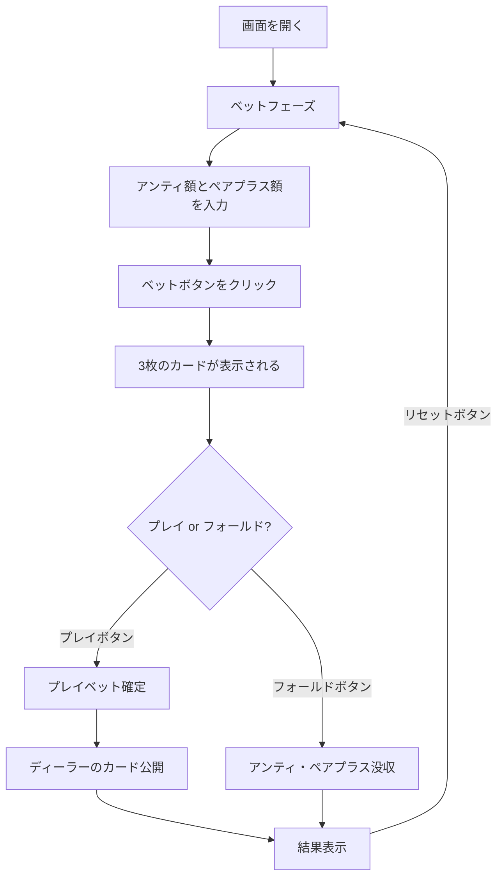

# スリーカードポーカー（Web版）遊び方

## ゲーム概要

カジノの人気カードゲームです。3枚のカードでディーラーと勝負します。アンティベットとオプションのペアプラスサイドベットを組み合わせてプレイします。

## 起動方法

```sh
go run ./cmd/cli web        # CLI経由でWebサーバーを起動
go run ./cmd/server         # 直接Webサーバーを起動
```

ブラウザで `http://localhost:8080` にアクセスし、ナビゲーションバーから「スリーカードポーカー」を選択します。
ナビバーのJA/ENボタンで日本語・英語を切り替えられます。

## ルール

### 基本ルール

- 52枚のトランプ（ジョーカーなし）を使用
- プレイヤーとディーラーにそれぞれ3枚ずつ配る
- プレイヤーはアンティベット後、自分の手札を見てプレイまたはフォールドを決定
- ディーラーはQ-ハイ以上で「クオリファイ（資格あり）」

### 手札ランキング（強い順）

| ランク | 説明 |
|--------|------|
| ストレートフラッシュ | 同じスートの連続3枚 |
| スリーオブアカインド | 同じランク3枚 |
| ストレート | 連続する3枚（スート不問） |
| フラッシュ | 同じスートの3枚（連続でない） |
| ペア | 同じランク2枚 |
| ハイカード | 上記以外 |

### ベットタイプと配当

**アンティ/プレイベット:**

| 条件 | アンティ配当 | プレイ配当 |
|------|-------------|-----------|
| ディーラー不資格 | 1:1 | プッシュ（返却） |
| プレイヤー勝ち | 1:1 | 1:1 |
| ディーラー勝ち | 没収 | 没収 |
| 引き分け | プッシュ | プッシュ |

**アンティボーナス（プレイヤーの手札に対して自動支払い）:**

| 役 | 配当 |
|----|------|
| ストレートフラッシュ | 5:1 |
| スリーオブアカインド | 4:1 |
| ストレート | 1:1 |

**ペアプラス（サイドベット、勝敗に関係なく支払い）:**

| 役 | 配当 |
|----|------|
| ストレートフラッシュ | 40:1 |
| スリーオブアカインド | 30:1 |
| ストレート | 6:1 |
| フラッシュ | 3:1 |
| ペア | 1:1 |

## ゲームの流れ



## 画面の操作方法

### ベットフェーズ

1. **アンティ額**: 数値入力欄でアンティベット額を設定（10刻み、最低10、最大は所持チップ数）
2. **ペアプラス額（任意）**: ペアプラスサイドベット額を設定（0で無効）
3. **「ベット」ボタン**: クリックでベットを確定し、カードが配られる

### アクションフェーズ

1. プレイヤーの3枚のカードと役名が表示されます
2. **「プレイ」ボタン**: アンティと同額のプレイベットを置いてディーラーと勝負
3. **「フォールド」ボタン**: アンティとペアプラスを放棄

### 結果フェーズ

1. プレイヤーとディーラーのカードが表示されます
2. ディーラーの資格有無が表示されます
3. 結果メッセージと各配当（アンティ、プレイ、アンティボーナス、ペアプラス）が表示されます
4. **「リセット」ボタン**: 新しいラウンドを開始
5. **「棋譜を見る」ボタン**: アクションログを表示

### キーボードショートカット

ゲーム中、以下のキーボードショートカットが使用できます。

| キー | アクション | 有効条件 |
|------|-----------|---------|
| `b` | ベット | ベットフェーズのみ |
| `p` | プレイ | アクションフェーズのみ |
| `f` | フォールド | アクションフェーズのみ |
| `r` | リセット | 結果フェーズのみ |

※ テキスト入力欄にフォーカスがある場合、ショートカットは無効になります。

## 画面構成

```
┌────────────────────────────────────────────┐
│           チップ: 1000                      │
├────────────────────────────────────────────┤
│  プレイヤーの勝ち！                         │
│                                            │
│  あなたの手札: ペア                         │
│  [♠K] [♥K] [♦9]                           │
│                                            │
│  ディーラー: ハイカード                      │
│  [♣J] [♦8] [♠5]                           │
│  ディーラー不資格                           │
│                                            │
│  アンティ配当: 200  プレイ返却: 100          │
│  ペアプラス配当: 100                        │
│  合計配当: 400                              │
├────────────────────────────────────────────┤
│  [リセット] [棋譜を見る]                     │
└────────────────────────────────────────────┘
```

## 遊び方のコツ

- Q-6-4以上の手札でプレイするのが最適戦略です
- ペアプラスはハウスエッジが高め（約7.3%）ですが、高配当のチャンスがあります
- アンティ/プレイのハウスエッジは約3.4%で比較的低めです
- アンティボーナスはプレイヤーに有利な追加配当なので、良い手はプレイしましょう
