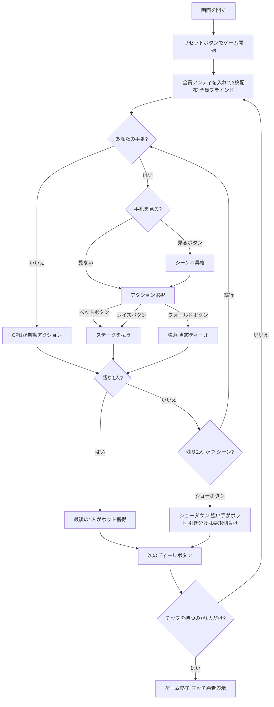

# スリーカード・ブラグ（Web版）遊び方

## ゲーム概要

Three Card Brag（スリーカード・ブラグ）は4人用のイギリスの賭けゲーム（vying game）で、ポーカーの祖先のひとつです。**52枚のデッキ**を使い、各自3枚の手札とチップ・ポットで勝負します。全員がアンティ（参加料）をポットに入れて3枚ずつ配られ、各プレイヤーは手札を見ない**ブラインド（Blind）**か、見た**シーン（Seen）**かの状態を持ちます。ブラインドはシーンの半額（本実装: Blind=ステーク／Seen=2×ステーク）で賭けられ、いつでも手札を見てシーンへ昇格できます。手番では **ベット（コール）／レイズ／フォールド** を選び、最後の1人になればポットを獲得します。残り2人になるとシーンのプレイヤーは **ショー（Show）** でショーダウンを要求でき、強い手がポットを取ります（引き分けはショー要求側の負け）。チップが尽きたプレイヤーは脱落し、最後にチップを持つプレイヤーがマッチの勝者です。手役の強さは Prial（スリーカード）＞ Running Flush（ストレートフラッシュ）＞ Run（ストレート）＞ Flush（フラッシュ）＞ Pair（ペア）＞ High Card（ハイカード）の順です。あなたは人間プレイヤーとして3人の CPU と対戦します。

## 起動方法

```sh
go run ./cmd/trumpcards web         # CLI経由でWebサーバーを起動
go run ./cmd/trumpcards web --open  # サーバー起動 + ブラウザを開く
go run ./cmd/server                 # 直接Webサーバーを起動
```

ブラウザで `http://localhost:8080` にアクセスし、ナビゲーションバーから「スリーカード・ブラグ」を選択します。
ナビバーのJA/ENボタンで日本語・英語を切り替えられます。

## ルール

### デッキと配布

- **デッキ**: 52枚（標準デッキ）
- **プレイヤー**: 4人（あなた + CPU3人）
- **アンティ**: 全員が既定額のチップをポットに入れます。
- **配布**: 各プレイヤー3枚。配られた直後は全員が**ブラインド（手札未確認）**の状態です。

### ブラインドとシーン

- **ブラインド（Blind）**: 手札を見ていない状態。賭け額は**ステーク（Blind = stake）**。
- **シーン（Seen）**: 手札を見た状態。賭け額は**ステークの2倍（Seen = 2 × stake）**。
- **「見る」(See)** でいつでも手札を見て、ブラインドからシーンへ昇格できます（一度見たら戻れません）。

### 手役の強さ

- 強い順は Prial（スリーカード）＞ Running Flush（ストレートフラッシュ）＞ Run（ストレート）＞ Flush（フラッシュ）＞ Pair（ペア）＞ High Card（ハイカード）。
- 同じ役どうしはカードのランクで比較します。
- **特例**: **3-3-3** が最強の Prial、**A-2-3** が最強の Run です。

### ベッティングフェーズ

手番では次のいずれかを選びます。

- **「ベット」(Bet)**: 現在のステークにコールしてポットに払います（ブラインドはステーク、シーンは2×ステーク）。
- **「レイズ」(Raise)**: ステークを引き上げてからコールします。
- **「フォールド」(Fold)**: 降ります。それまでの掛け金は戻りません。
- 自分以外の全員がフォールドすると、**最後に残った1人がポットを獲得**します（ショーダウンなし）。

### ショー（ショーダウン）

- 残りが**2人**になると、**シーンのプレイヤー**は **2 × ステーク** を払って **「ショー」(Show)** を要求できます。
- 互いの手役を比べ、**強い手がポットを獲得**します。
- **引き分けの場合は、ショーを要求した側の負け**になります。

### チップと勝利条件

- ディールの勝者がポットを総取りします。
- チップが尽きたプレイヤーは**脱落**します。
- 最後までチップを持って残った1人が**マッチの勝者**です。

## ゲームの流れ



## 画面の操作方法

### BETTINGフェーズ（ベッティングフェーズ）

- あなたの手番のとき、ブラインドなら **「見る」**ボタンが表示されます。押すと手札が表示され、シーンへ昇格します。
- **「ベット」ボタン**: 現在のステークにコールします（ブラインドはステーク、シーンは2×ステーク）。
- **「レイズ」ボタン**: ステークの引き上げ額を指定してコールします。
- **「フォールド」ボタン**: このディールから降ります。
- 残り2人になり、あなたがシーンのときは **「ショー」ボタン** が表示されます。

### ショーダウン時

- ショーが要求されると両者の手札が公開され、手役を比較してポットの行き先が表示されます（引き分けは要求側の負け）。

### ディール終了時

- **「次のディール」ボタン**: ポットを清算して次のディールへ進みます。チップを持つのが1人だけになればゲーム終了です。

## 画面構成

```
┌─────────────────────────────────────────────────────────┐
│  Three Card Brag (スリーカード・ブラグ) [JA/EN] [CLI]    │
├─────────────────────────────────────────────────────────┤
│  ディール: 1  フェーズ: BETTING                          │
│  ポット: 40  ステーク: 10                                │
│  あなた=100  CPU1=100  CPU2=100  CPU3=100                │
├──────────┬──────────────────────────────────────────────┤
│  CPU1/2/3 │                                              │
│  状態:    │     ポット・場の状況表示エリア               │
│  Blind/   │     （各プレイヤーの賭け・フォールド状況）    │
│  Seen     │                                              │
├──────────┼──────────────────────────────────────────────┤
│  メッセージ・結果表示                                     │
├──────────┴──────────────────────────────────────────────┤
│  あなたの手札（シーン時のみ表示）                         │
│  [A♠][A♥][A♦]                                           │
│  [見る]                          ← ブラインド時          │
│  [ベット][レイズ][フォールド]    ← BETTINGフェーズ       │
│  [ショー]                        ← 残り2人・シーン時      │
│  [次のディール]                  ← ディール終了時        │
└─────────────────────────────────────────────────────────┘
```

- **ヘッダー**: ゲーム名・フェーズ表示・言語切り替えトグル・CLI切り替えトグル。
- **ディール／フェーズ表示**: 現在のディール番号とフェーズ（BETTING / SHOWDOWN）。
- **ポット・ステーク行**: 現在のポット総額と1回あたりのステーク。
- **チップ**: あなたと各 CPU の残りチップをリアルタイムで表示（尽きると脱落）。
- **プレイヤー表示エリア（左）**: 各 CPU のブラインド／シーン状態とフォールド状況。
- **場の状況エリア（中央）**: 賭けの進行・残り人数。
- **メッセージボックス**: フェーズ・アクション・ディール結果・勝敗の案内。
- **フッター（手札エリア）**: あなたの手札（シーン時のみ表示）と操作ボタン（ブラインドは見る、BETTINGはベット／レイズ／フォールド、残り2人はショー、ディール終了時は次のディール）。

## 遊び方のコツ

- **ブラインドの価値**: ブラインドはシーンの半額で賭けられます。チップが少ないときや序盤は、あえて見ずにブラインドで安く粘るのも有効です。
- **シーン昇格のタイミング**: 強い手なら「見る」でシーンになり、強気にレイズしてポットを膨らませましょう。弱ければ早めの「フォールド」で損失を抑えます。
- **ショーの引き分けリスク**: 「ショー」は要求側が引き分けで負けます。同等の手では迂闊に要求せず、明確に勝てる確信があるときだけ要求しましょう。
- **手役の特例を覚える**: **3-3-3** が最強の Prial、**A-2-3** が最強の Run です。これらは見た目以上に強いので過小評価しないこと。
- **チップ管理**: チップが尽きれば脱落です。1ディールに賭けすぎず、残りチップとポットのバランスを見て降り際を判断しましょう。
