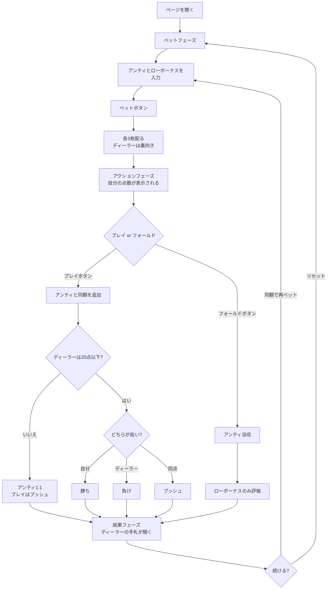

# スリーカード・ラミー（Web版）遊び方

## ゲーム概要

3枚のカードでディーラーと勝負するカジノゲームです。**このゲームだけは点数が低いほど強く、0点が最強**——ポーカー系の直感がそのまま裏返ります。絵札は10点、Aは1点、それ以外は数字どおり。ただし同ランク3枚、または同スートの連番3枚（「役」）は合計ではなく**0点**として数えます。

アンティベットと、任意のローボーナスサイドベットを組み合わせてプレイします。

## 起動方法

```sh
go run ./cmd/trumpcards web   # CLI経由でサーバを起動
go run ./cmd/server           # サーバを直接起動
```

ブラウザで `http://localhost:8080/threecardrummy` を開きます。

## ルール

### 基本ルール

- 52枚のトランプ（ジョーカーなし）を使用
- プレイヤーとディーラーにそれぞれ3枚ずつ配る。**ディーラーの3枚は勝負するまで裏向き**
- プレイヤーはアンティベット後、自分の手札を見てプレイまたはフォールドを決定
- **ディーラーは合計20点以下で「クオリファイ（資格あり）」**

### 点数の数え方

| カード | 点数 |
|--------|------|
| A | 1（**11にはならない**） |
| 2〜10 | 数字どおり |
| J / Q / K | 10 |

**役（0点）:**

| 役 | 説明 | 例 |
|----|------|-----|
| 同ランク3枚 | 同じランクが3枚 | K♠ K♥ K♦（素点30 → 0点） |
| 同スート連番3枚 | 同じスートで連続する3枚 | Q♠ K♠ A♠（素点21 → 0点） |

Aは並びの**下端にも上端にも**付きます（A-2-3 も Q-K-A も役）。ただし K-A-2 のように跨ぐ並びは役になりません。

### 勝敗

| 条件 | 結果 |
|------|------|
| ディーラーがクオリファイせず | アンティ1:1、プレイベットはプッシュ（勝敗に関係なく） |
| 自分の点数 < ディーラーの点数 | 勝ち（アンティ・プレイとも1:1） |
| 自分の点数 > ディーラーの点数 | 負け（アンティ・プレイとも没収） |
| 同点 | プッシュ（両方返却） |

### ボーナス配当

**アンティボーナス**（プレイした場合のみ、ディーラーの結果に関係なく）:

| 自分の点数 | 配当 |
|-----------|------|
| 0点（役） | 9:1 |
| 1〜5点 | 3:1 |
| 6〜10点 | 1:1 |

**ローボーナス**（サイドベット、ディーラーと完全に無関係）:

| 自分の点数 | 配当 |
|-----------|------|
| 0点（役） | 100:1 |
| 1〜5点 | 20:1 |
| 6〜10点 | 4:1 |

**フォールドしてもローボーナスは評価されます。** 降りたのは勝負であって、この賭けではありません。

## ゲームの流れ



## 画面の操作方法

| 操作 | 説明 |
|------|------|
| アンティ入力 | チップ額を選んでアンティを設定（10以上の10の倍数） |
| ローボーナス入力 | 任意のサイドベット額。0なら賭けない |
| ベットボタン | ベットを確定してカードを配る |
| プレイボタン | アンティと同額を追加して勝負する |
| フォールドボタン | 降りる。アンティを失うが、ローボーナスは評価される |
| 同額で再ベット | 直前のラウンドと同じアンティ・ローボーナスでもう一度 |
| リセットボタン | ゲームを最初からやり直す |
| ヒントのトグル | アクションフェーズでプレイ/フォールドの助言を表示 |
| 配当表 | ベットフェーズで開くとアンティボーナスとローボーナスの倍率一覧を確認できる |
| CLIモード | 画面上でコマンド入力に切り替える（`b`, `p`, `f`, `rb`, `h`, `log`, `r`） |

## 画面構成

- **上部**: 現在のチップ額とフェーズ。ベットフェーズでは点数の数え方とクオリファイ条件が併記されます
- **中央（プレイヤー）**: 自分の3枚と**点数**。カードが配られた時点から表示され、0点のときは「0点（役 = 最強）」と明示されます
- **中央（ディーラー）**: 3枚のカード。**アクションフェーズまでは裏向き**で、点数も「？」のまま。結果フェーズで表向きになり、点数とクオリファイの有無が出ます
- **下部**: フェーズに応じたボタン（ベット / プレイ・フォールド / リセット）
- **結果表示**: 勝敗メッセージと、アンティ・プレイ・アンティボーナス・ローボーナス・合計の配当内訳
- **アクションログ**: そのラウンドの操作履歴
