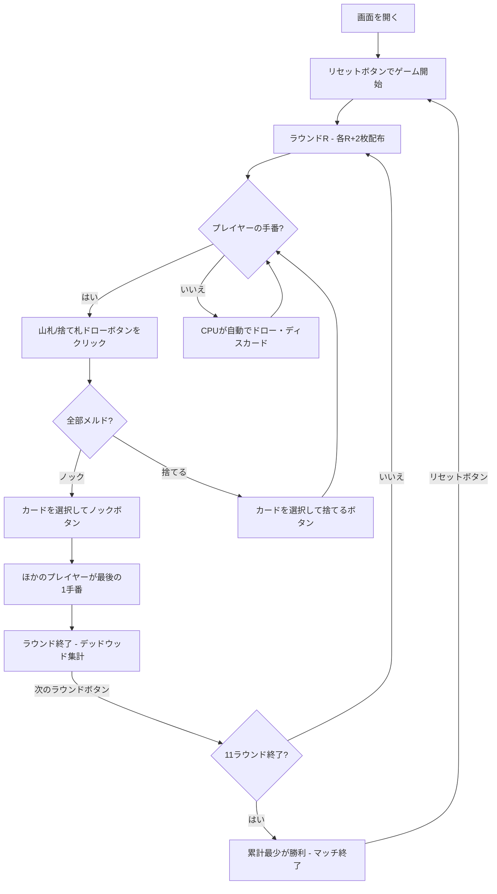

# スリー・サーティーン（Web版）遊び方

## ゲーム概要

スリー・サーティーン（Three Thirteen / 3-13）は、104枚（標準52枚デッキ2組）を使うラミー系カードゲームです。2〜4人（プレイヤー1人 + CPU 1〜3人）で遊びます。全11ラウンドで構成され、ラウンドごとに配られる手札の枚数が増え（ラウンド1は3枚、ラウンド11は13枚）、そのラウンドのワイルドランクも変化します（ラウンドRではランクR+2がワイルド）。手札からカードを引き、捨て、すべてがメルドになったらノックします。各ラウンドのデッドウッド（メルドに含まれないカードの合計点）が累積され、11ラウンド終了時に累計点が最も少ないプレイヤーが勝者です。

## 起動方法

```sh
go run ./cmd/trumpcards web  # CLI経由でWebサーバーを起動
go run ./cmd/server          # 直接Webサーバーを起動
```

ブラウザで `http://localhost:8080` にアクセスし、ナビゲーションバーから「スリー・サーティーン」を選択します。
ナビバーのJA/ENボタンで日本語・英語を切り替えられます。

## ルール

### 基本ルール

- 標準52枚デッキ2組（104枚）を使用、2〜4人プレイ
- 全11ラウンド。ラウンドR（1〜11）では各プレイヤーにR+2枚配る（3枚→13枚）
- 1枚を表向きにして捨て札の山を開始、残りは山札（ストック）
- 手番ではまず山札または捨て札の山からカードを1枚ドローする
- その後、手札からカードを1枚捨てる。手札がすべてメルドになっていれば、捨てると同時にノックできる

### ワイルドランク

- ラウンドRでは、ランク R+2 がそのラウンドのワイルドカードとして扱われる
- ラウンド1=3、ラウンド2=4、…、ラウンド9=J、ラウンド10=Q、ラウンド11=K がワイルド
- ワイルドカードはメルドの中で任意のカードの代わりに使える

### メルドとデッドウッド

- **メルド**: セット（同ランク3枚以上）またはラン（同スート3枚以上の連番）
- **デッドウッド**: メルドに含まれない手札の合計点（A=1点、2〜10=額面、J/Q/K=10点）

### ノック

- **ノック**: 1枚を捨てたあと、残りの手札がすべてメルドになっている（デッドウッド0）ときにノックできる
- ノック後、ほかのプレイヤーはそれぞれ最後の1手番を取る
- そのラウンドはノック後の最終手番で終了し、各プレイヤーのデッドウッドが集計される

### 得点とゲーム終了

- 各ラウンドの終了時、各プレイヤーのデッドウッド点が累積得点に加算される
- 11ラウンドすべてを終えたとき、累積得点が最も少ないプレイヤーがマッチの勝者

### CPU難易度

- **Easy**: ランダムにカードを出す
- **Normal**: 基本的なメルド戦略（デフォルト）
- **Hard**: 戦略的なプレイ（相手の捨て札を分析等）

## ゲームの流れ



## 画面の操作方法

### ドローフェーズ

1. **「山札から引く」** ボタンでストックから1枚引く
2. **「捨て札から引く」** ボタンで捨て札の山のトップカードを引く

### ディスカード/ノックフェーズ

1. 手札のカードをクリックして選択（1枚）
2. **「捨てる」** ボタンで選択したカードを捨てる
3. **「ノック」** ボタンで選択カードを捨ててノック（残りの手札がすべてメルドの場合のみ成立）
   - デッドウッドインジケーターで現在の手札のデッドウッド合計を確認できます

### ラウンド終了

1. **「次のラウンド」** ボタンで次のラウンドに進む

## 画面構成

```
┌────────────────────────────────────────────┐
│  ▶ 設定 (クリックで展開)                   │
│    CPU難易度:    [Normal▼]                 │
│    プレイヤー人数: [2▼]                    │
├────────────────────────────────────────────┤
│  ラウンド 2/11 | ワイルド: 4 | 手札枚数: 4  │
│  | 山札: 30枚                              │
│  捨て札トップ: ♥7                          │
├────────────────────────────────────────────┤
│              CPU エリア                     │
│  CPU 1: 4枚 | 累計: 10 | ラウンド: 3       │
├────────────────────────────────────────────┤
│              スコアテーブル                 │
│  プレイヤー  ラウンド  累計                 │
├────────────────────────────────────────────┤
│         フッター: あなた                     │
│  デッドウッド: 11点                         │
│  [♠A][♠4][♥J][♣2]                         │
│  [リセット] [山札から引く] [捨て札から引く]  │
│  [捨てる] [ノック]                          │
└────────────────────────────────────────────┘
```

- **設定パネル（▶ 設定）**:
  - 「CPU難易度」セレクト: Easy / Normal / Hard から選択
  - 「プレイヤー人数」: 2〜4人から選択
  - 次のリセット時に設定が適用される
- **ゲーム情報**: 現在のラウンド、そのラウンドのワイルドランク、配り枚数、山札残り枚数、捨て札トップ
- **CPUエリア**: 各CPUの手札枚数とスコア
- **フッター（あなたの手札）**:
  - クリックで選択（緑枠 + 上に浮き上がる）
  - デッドウッド合計点を表示
- **スコアテーブル**: 各プレイヤーのラウンドスコアと累積スコア

## 遊び方のコツ

- そのラウンドのワイルドランクを最大限活用してメルドを素早く完成させましょう
- デッドウッドの高いカード（J/Q/K=10点）は早めに処理するのが有効です
- 序盤の小さなラウンドは少ない手札で済むので、ミスのないプレイを心がけましょう
- ラウンドが進むほど手札が増えて難しくなるため、毎ラウンドのデッドウッドを抑えることが大切です
- 累計点が最少の人が勝つので、たとえ最終ラウンドで負けても全体で守りきれば勝てます
