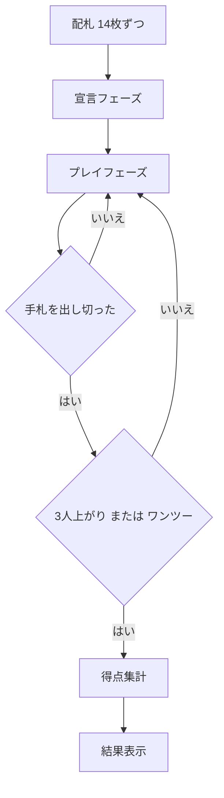

# ティチュー（Web版）遊び方

## ゲーム概要

ティチューは4人制・2対2のパートナーシップ型「大富豪系」カードゲームです。向かい合うプレイヤー (P0とP2、P1とP3) が味方チームになります。標準52枚に4枚の特殊カード (龍・鳳凰・犬・麻雀) を加えた56枚を使い、手札を早く出し切ることとカードの得点を集めることを競います。

> **原作クレジット**: 『Tichu（ティチュー）』は Urs Hostettler 氏が1991年に発表し、Fata Morgana Spiele が発行しているカードゲームです。本実装は非公式・非営利のファン実装であり、権利者とは関係がありません。ルールのみを独自に実装しており、原版のカードデザインやルールブック本文は使用していません。

## 起動方法

```sh
go run ./cmd/trumpcards web  # CLI経由でWebサーバーを起動
go run ./cmd/server          # 直接Webサーバーを起動
```

ブラウザで `http://localhost:8080` にアクセスし、ナビゲーションバーから「ティチュー」を選択します。
ナビバーのJA/ENボタンで日本語・英語を切り替えられます。

## ルール

- 4人 (あなた=P0 と CPU 3人)、チームは {P0, P2} 対 {P1, P3}。各自14枚配られます。
- プレイ前に「ティチュー (±100)」「グランドティチュー (±200)」を宣言できます。宣言して最初に上がればボーナス、失敗でペナルティ。
- 役: シングル / ペア / スリーカード / フルハウス / 連続 (5枚以上) / 連続ペア / ボム (4枚同ランク) / ストレートフラッシュ。場の役と同種・同枚数でより強い役のみ出せます。ボムは何でも上回り、ストレートフラッシュ > 4枚ボム。
- 特殊カード: 麻雀 (最弱・先手権)、犬 (パートナーにリードを譲る)、鳳凰 (ワイルド・-25点)、龍 (最強の単体・+25点・トリックは相手へ)。
- 得点カード: 5=5点、10とK=10点、龍=+25、鳳凰=-25 (合計100点)。
- 3人が上がるとディール終了。最後の1人の手札は相手チームへ、取ったトリックは最初に上がった人へ。ワンツー (同チーム1位2位独占) は+200。

## ゲームの流れ



## 画面の操作方法

- **宣言フェーズ**: あなたの番に「宣言しない」「ティチュー宣言」「グランド宣言」のボタンが表示されます。
- **プレイフェーズ**: 手札のカードをタップして選択し、「出す」ボタンで出します。場に役があるときは「パス」も選べます。
- **新しいゲーム**: フッターのリセットボタンから開始できます。
- **ヒント**: フッターのヒントを有効にすると、リード時やパス推奨などの助言が表示されます。

## 画面構成

- 上部: フェーズ名と手番表示、爆弾使用回数、CLIトグル。
- 中央上: CPU各プレイヤーのチーム・残り枚数・宣言。
- 中央: テーブル (現在支配している役)。
- 下部: あなたの手札と操作ボタン。
- 終了時: チームA/Bの得点とワンツー表示。

## 遊び方のコツ

- パートナーが場を支配しているときはパスして味方を上がらせましょう。チーム合計で勝敗が決まります。
- 鳳凰は競り合いの単体勝負や、ストレート・フルハウスの穴埋めに使えます。
- ボムは相手の高得点トリックを奪うときに温存して使うと強力です。
- ティチュー宣言は確実に最初に上がれる強い手のときだけ。失敗するとチームに大きな失点となります。
