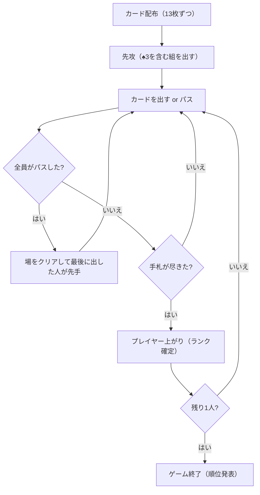

# ティエンレン（Web版）遊び方

## ゲーム概要

Tien Len (ティエンレン) は、ベトナムの国民的トランプゲームで、欧米では "Vietnamese Poker" や "Thirteen" とも呼ばれる手札消化 (シェディング) ゲームです。4人で遊び、手札を最も早く出し切ったプレイヤーが勝者です。スートの強さが厳密に決まっている点と、最強カード「2」をチョップ役で撃ち落とせる点が特徴です。

## 起動方法

```sh
go run ./cmd/trumpcards web  # CLI経由でWebサーバーを起動
go run ./cmd/server          # 直接Webサーバーを起動
```

ブラウザで `http://localhost:8080` にアクセスし、ナビゲーションバーから「ティエンレン」を選択します。
ナビバーのJA/ENボタンで日本語・英語を切り替えられます。

## ルール

- **デッキ**: 52枚（ジョーカーなし）を4人に13枚ずつ配ります。
- **カードの強さ**: 数字 `3 < 4 < 5 < 6 < 7 < 8 < 9 < 10 < J < Q < K < A < 2`、同数ならスート `♠ < ♣ < ♦ < ♥`（例: ♠2 より ♥2 の方が強い）。
- **先攻**: 最弱の ♠3 を持つプレイヤーが最初にプレイし、♠3 を含むカードを出す必要があります。
- **役（コンビネーション）**: シングル / ペア / スリーカード / ストレート（3枚以上の連続、スート混在可。最も強いカードで強さを比較）。
- **チョップ役（爆弾）**: 「連続する3つのペア（例: 44-55-66）」は単体の「2」を切れます。「フォーカード」は単体の「2」と連続3ペアを切れます。
- **出し方**: 前の人と同じ役・同じ枚数で、より強いカードを出します。出せない・出したくない場合はパス。
- **場のリセット**: 全員がパスすると場がクリアされ、最後にカードを出したプレイヤーが自由に出せます。
- **勝利条件**: 最初に手札を全て出し切ったプレイヤーが1位。

## ゲームの流れ



## 画面の操作方法

1. 手札のカードをクリックして選択します（複数選択可）。
2. 「選択したカードを出す」ボタンを押してカードを出します。
3. パスしたい場合は「パス」ボタンを押します。
4. 設定パネルからCPU難易度を変更できます。

## 画面構成

- **上部**: CPUプレイヤーの残り枚数とカード裏面。
- **中央**: 場に出されたカード。
- **下部**: あなたの手札（クリックで選択）と操作ボタン。
- **フッター**: リセットボタン、設定、棋譜。

## 遊び方のコツ

- 弱いカードから出して、強いカード（特に2やA）を温存しましょう。
- ペアやストレートで出すことで、相手が出しにくくなります。
- 相手が出した単体の「2」は、連続3ペアやフォーカード（チョップ役）で撃ち落とせます。
- 相手の残り枚数に注意し、上がり間際の相手には強いカードで蓋をしましょう。
