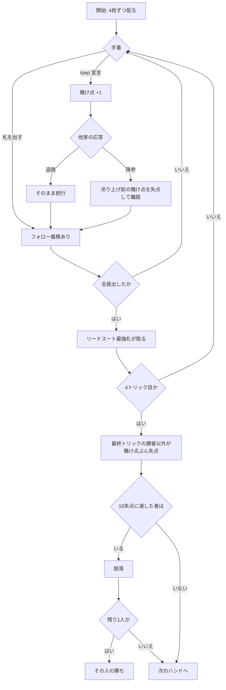

# Toepen (トゥーペン) — Web マニュアル

## ゲーム概要

オランダのパブで遊ばれるブラフ系トリックテイキング。32 枚デッキ、手札 4 枚、切札なし。**最終トリックを取った者だけが失点を免れ**、累計 10 失点で脱落します。

いつでも「toep」を宣言して賭け点を吊り上げられ、受けた側は追随するか降りるかを選びます。

## 起動方法

1. `go run ./cmd/trumpcards web` でサーバーを起動します
2. ブラウザで `http://localhost:8080` を開きます
3. ゲーム一覧から **Toepen** を選ぶか、`/toepen` へ直接アクセスします

## ルール

- **デッキ**: 32 枚（7〜A + J・Q・K）
- **配札**: 各自 4 枚
- **序列（最重要）**: **10（最強）> 9 > 8 > 7 > A > K > Q > J（最弱）**
  > **数札が A より強く、絵札が最弱**です。標準的な序列を丸ごと裏返した構成で、これがトゥーペンの正体です。10 が最強、**J が最弱**であることを間違えると、まず勝てません。
- **切札はありません。**リードスートの最強札がトリックを取ります
- **フォロー義務あり**: リードスートを持っていれば、それを出さなければなりません
- **失点**: ハンド終了時、**最終トリックを取った者以外の全員**が賭け点ぶん失点します
- **toep**: いつでも宣言でき、賭け点が 1 増えます。他家は追随（`s`）か降参（`f`）を選びます
  - **降参のコストは吊り上げ*前*の賭け点**です。1 回目の toep に降りれば 1 点、2 回目なら 2 点
- **脱落**: 累計 10 失点で脱落。最後に残った者が勝ちます
- **人数**: 3〜8 人（本実装の既定は 4 人）
- **貧民の配り直し**: 手札が **A・K・Q・J だけ**（＝最弱 4 種のみ）なら、**1 枚も出す前に限り**捨てて配り直しを要求できます
  > 卓上のルールでは他家が異議を唱えられ、外れた側が失点します。**本実装に異議はありません。**異議が存在するのは人間同士では宣言の真偽を確かめようがないからで、サーバーが手札を持っている以上そこは検証で済みます。嘘の宣言はそもそも通らないので、異議を残しても「必ず外れるボタン」にしかなりません

## ゲームの流れ

## 画面の操作方法

| 操作 | 説明 |
|------|------|
| 手札のカードをクリック | その札を出します。フォロー義務で出せない札は選択できません |
| **toep** ボタン | 賭け点を 1 上げます |
| **追随** / **降参** ボタン | toep を受けたときに選びます |
| **配り直し** ボタン | 手札が A/K/Q/J だけのときに現れます。1 枚も出す前に限り使えます |
| **次のハンド** ボタン | 精算後、次のハンドへ進みます |
| **ヒント** トグル | 推奨する手をハイライトします |
| **設定** パネル | 人数と CPU 難易度を変更してリセットします |
| **CLI** トグル | ターミナル風の操作に切り替えます |

## 画面構成

- **フェーズ表示**: ハンド番号・トリック番号・現在の賭け点
- **序列表示**: `10 > 9 > 8 > 7 > A > K > Q > J` を常時表示します。このゲームで最も間違えやすいためです
- **場**: このトリックに出された札
- **手札**: 自分の手札。出せない札は選択できません
- **失点表**: 各プレイヤーの失点と、降参・脱落の状態
- **アクションログ**: ハンドの進行を後から追えます

## 遊び方のコツ

- **10 を持っていることの価値**を過小評価しないでください。A より、K より強い最強札です
- 逆に **J・Q・K・A は最弱の 4 枚**です。絵札だらけの手札は弱い手札です
- **最終トリックだけが免罪**なので、序盤のトリックは取っても意味がありません。強い札は最後まで温存してください
- **toep は「勝てる」ときより「相手が降りる」ときに効きます。**降参は吊り上げ前の点で済むので、相手は安く逃げられます。逃がしたくない場面でこそ使ってください
- 失点が 9 の相手に toep をかけると、追随すれば脱落、降参でも脱落という状況を作れます
