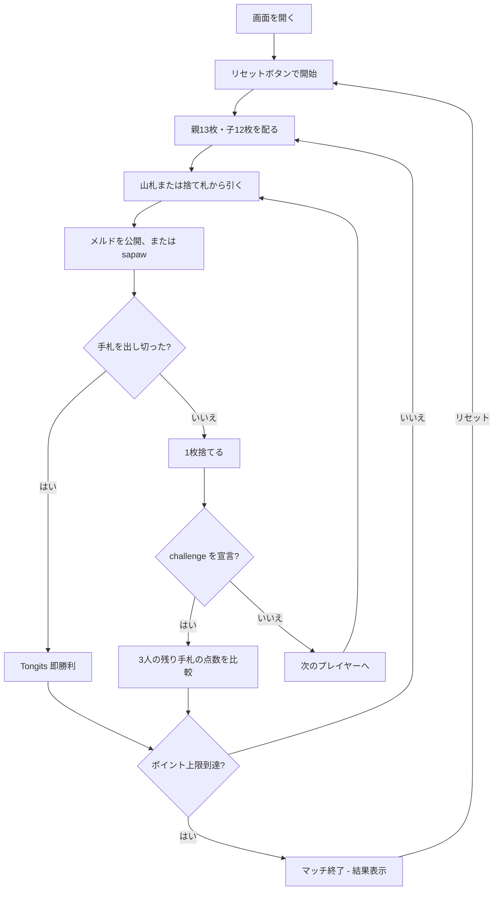

# トンギッツ（Web版）遊び方

## ゲーム概要

トンギッツは、52枚のトランプで遊ぶ3人固定のフィリピン発祥ラミーです。親（プレイヤー0）には13枚、子（プレイヤー1・2）には12枚を配ります。メルドを場に公開し、他家のメルドにも sapaw で札を付け足しながら手札をなくします。手札を出し切ったプレイヤーは即勝利です。

## 起動方法

```sh
go run ./cmd/trumpcards web  # CLI経由でWebサーバーを起動
go run ./cmd/server          # 直接Webサーバーを起動
```

ブラウザで `http://localhost:8080` にアクセスし、ナビゲーションバーから「トンギッツ」を選択します。ナビバーのJA/ENボタンで表示言語を切り替えられます。

## ルール

### 基本ルール

- 52枚を使い、プレイヤー3人で遊びます。
- 親（プレイヤー0）は13枚、子（プレイヤー1・2）は12枚です。残りの札は山札と捨て札の山になります。
- 手番では山札または捨て札の山から1枚引き、メルドを公開するか、公開済みのメルドへ sapaw し、必要なら最後に1枚捨てます。
- メルドは同じランク3枚以上のセット、または同じスートの連続した3枚以上のランです。
- 手札をすべて場に出し切ると Tongits の即勝利です。

### 公開メルドと sapaw

- 公開メルドは中央のゲーム情報エリアに表示され、全員が確認できます。
- 自分のメルドにも他家のメルドにも、条件を満たす札を付け足せます。これが sapaw です。
- 付け足しや公開に使わなかった札は手札に残ります。

### challenge（ドロー宣言）

- ドローを宣言するとラウンドが終わり、3人の残り手札の点数を比較します。
- Aは1点、2〜10は数字どおり、J・Q・Kは10点です。
- 合計点が最も少ないプレイヤーがそのラウンドに勝ちます。手札を出し切った即勝利の場合は、宣言を待たずに終了します。

### ゲーム終了

- ラウンドの点数を累積し、設定したポイント上限に達するとマッチ終了です。

## ゲームの流れ



## 画面の操作方法

### ドローフェーズ

1. **「山札から引く」** ボタンで山札から1枚引きます。
2. **「捨て札から引く」** ボタンで捨て札のトップを引きます。

### メルド・sapaw・捨て札

1. 手札の札をクリックして選択します。
2. 選択した札をメルドとして公開するか、場のメルドへ sapaw します。
3. 残す札を整理したら、**「捨てる」** ボタンで1枚を捨てます。

### ラウンド終了

1. **「次のラウンド」** ボタンで次のラウンドに進みます。
2. 手札を出し切った場合は Tongits として即終了します。
3. challenge の場合は3人の残り手札の点数が比較され、最少点のプレイヤーが勝ちます。

## 画面構成

Web版の初期画面は、設定パネル、CPU 2人のエリア、ゲーム情報、プレイヤーの手札と操作ボタン、スコアテーブルの順に表示されます。初期状態では親の手札13枚と、子2人の手札枚数12枚が表示されます。

```
┌────────────────────────────────────────────┐
│  ▶ 設定                                    │
│    CPU難易度:    [Normal▼]                 │
│    ポイント上限: [50▼]                     │
├────────────────────────────────────────────┤
│              CPU 1 エリア                  │
│  🂠🂠🂠🂠🂠🂠🂠🂠🂠🂠🂠🂠 (裏向き)             │
│              CPU 2 エリア                  │
│  🂠🂠🂠🂠🂠🂠🂠🂠🂠🂠🂠🂠 (裏向き)             │
│              ゲーム情報                    │
│  ラウンド 1 | 山札: 14枚                   │
│  捨て札トップ: ♥A                           │
│  メルド: まだありません                     │
├────────────────────────────────────────────┤
│         あなた (13枚)                      │
│  [♠A][♠3][♠4][♠8][♣A][♣5][♣7]             │
│  [♣J][♥Q][♦A][♦9][♦Q][♦K]                  │
│  [山札から引く] [捨て札から引く]            │
│  [公開/付け足し] [捨てる]                  │
├────────────────────────────────────────────┤
│  スコア: プレイヤー0 0 | CPU 1 0 | CPU 2 0 │
└────────────────────────────────────────────┘
```

- 設定パネルではCPU難易度とポイント上限を選び、次のリセット時に適用します。
- CPUエリアの札は通常は裏向きで、ラウンド終了時に公開されます。
- 中央のゲーム情報にはラウンド、山札、捨て札トップ、公開メルドが表示されます。
- 手札はクリックして選択します。選択した札を公開または sapaw に使い、不要な1枚を捨てます。
- スコアテーブルには3人のラウンド点と累積点が表示されます。

## 遊び方のコツ

- メルドを早く公開し、sapaw で自分と他家の場を活用しましょう。
- 出し切りを狙える組み合わせと、challenge に備えて点数を下げる札を見極めます。
- 他家の公開メルドに付け足せる札を残しておくと、手札を効率よく減らせます。
