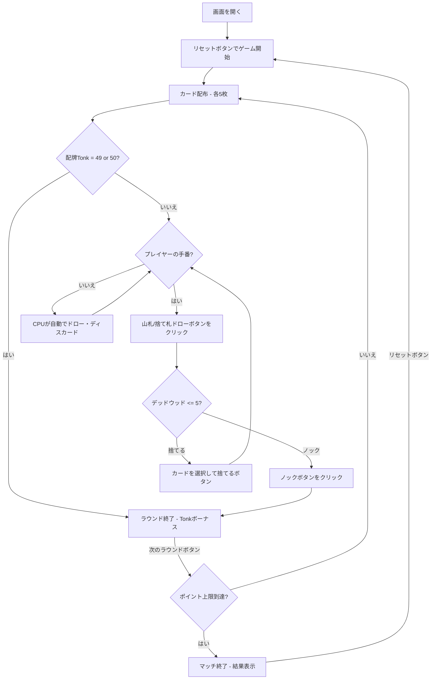

# トンク（Web版）遊び方

## ゲーム概要

2人（プレイヤー1人 + CPU 1人）で遊ぶ短時間ラミー系カードゲームです。手札5枚でメルド（セットやラン）を作り、デッドウッド（メルドに含まれないカード）の合計点を減らします。配牌時に49点・50点なら「Tonk」即勝利。先にポイント上限（デフォルト50点）に達したプレイヤーが勝利します。

## 起動方法

```sh
go run ./cmd/trumpcards web  # CLI経由でWebサーバーを起動
go run ./cmd/server          # 直接Webサーバーを起動
```

ブラウザで `http://localhost:8080` にアクセスし、ナビゲーションバーから「トンク」を選択します。
ナビバーのJA/ENボタンで日本語・英語を切り替えられます。

## ルール

### 基本ルール

- 52枚のトランプを使用、2人プレイ
- 各プレイヤーに5枚ずつ配り、1枚を表向きにして捨て札の山を開始、残りは山札（ストック）
- 配布直後、いずれかの手札合計が49点または50点なら「Tonk」即勝利（手札合計 + 50点ボーナス）
- 手番ではまず山札または捨て札の山からカードを1枚ドローする
- その後、手札からカードを1枚捨てるか、ノックする

### メルドとデッドウッド

- **メルド**: セット（同ランク3〜4枚）またはラン（同スート3枚以上の連番）
- **デッドウッド**: メルドに含まれない手札の合計点（J/Q/K=10点、A=1点、その他=額面）

### ノック・アンダーカット

- **ノック**: デッドウッド合計が**5点以下**の時にノック可能
- ノック直後にラウンド終了、デッドウッド差を計算
- **アンダーカット**: 相手のデッドウッドがノッカーより低い場合、相手にデッドウッド差 + 5点ペナルティが加算

### 配牌Tonk（即勝利）

- 配布5枚の合計点が49点または50点なら、Tonkを宣言して即ラウンド勝利
- スコア = 50点ボーナス + 手札合計

### ゲーム終了

- ポイント上限（デフォルト50点）に達したプレイヤーが出たらマッチ終了

### CPU難易度

- **Easy**: ランダムにカードを出す
- **Normal**: 基本的なメルド戦略（デフォルト）
- **Hard**: 戦略的なプレイ

## ゲームの流れ



## 画面の操作方法

### ドローフェーズ

1. **「山札から引く」** ボタンでストックから1枚引く
2. **「捨て札から引く」** ボタンで捨て札の山のトップカードを引く

### ディスカード/ノックフェーズ

1. 手札のカードをクリックして選択（1枚）
2. **「捨てる」** ボタンで選択したカードを捨てる
3. **「ノック」** ボタンでノック宣言（残りデッドウッドが5点以下の場合のみ成立）

### ラウンド終了

1. **「次のラウンド」** ボタンで次のラウンドに進む
2. 配牌Tonkが成立した場合は即ラウンド終了し、メッセージが表示される

## 画面構成

```
┌────────────────────────────────────────────┐
│  ▶ 設定 (クリックで展開)                   │
│    CPU難易度:    [Normal▼]                 │
│    ポイント上限: [50▼]                     │
├────────────────────────────────────────────┤
│              CPU エリア                     │
│  🂠🂠🂠🂠🂠 (裏向き)                          │
│  スコア: 0点                               │
├────────────────────────────────────────────┤
│              ゲーム情報                     │
│  ラウンド 1 | 山札: 41枚                   │
│  捨て札トップ: ♥7                          │
├────────────────────────────────────────────┤
│         フッター: あなた (0点)              │
│  [♠5][♥5][♦5][♣A][♠2]                     │
│  [リセット] [山札ドロー] [捨て札ドロー]      │
│  [捨てる] [ノック]                          │
└────────────────────────────────────────────┘
```

- **設定パネル（▶ 設定）**:
  - 「CPU難易度」セレクト: Easy / Normal / Hard から選択
  - 「ポイント上限」: マッチ終了のポイント上限を設定
  - 次のリセット時に設定が適用される
- **CPUエリア**: CPUの手札（裏向き）とスコア
- **ゲーム情報**: 現在のラウンド、山札残り枚数、捨て札トップ
- **フッター（あなたの手札）**: クリックで選択（緑枠 + 上に浮き上がる）
- **スコアテーブル**: 各プレイヤーのラウンドスコアと累積スコア

## 遊び方のコツ

- 5枚という少ない手札なので、配布直後の判定（Tonk可能性、メルド形成）が重要
- 高得点カード（10/J/Q/K = 10点）が多いとデッドウッドが高くなりやすい
- 序盤は捨て札からドローしてメルドを素早く作りましょう
- 相手のノックに備えて、自分のデッドウッドを5点以下にしておく
- アンダーカット（相手のノックを返す）は5点ペナルティ獲得のチャンス
