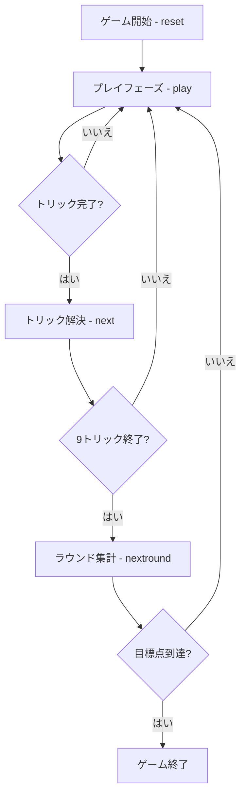

# トラッポラ（Web版）遊び方

## ゲーム概要

Trappola（トラッポラ）は16世紀のヴェネツィアやボヘミアで遊ばれた、切り札のない純粋なトリックテイキングゲームです。**専用の36枚デッキ**（A,3,4,5,6,7,J,Q,K — 2 と 8・9・10 を除く）を4人（2対2のチーム戦）に**9枚ずつ配り切り**、マストフォローの制約の中でパートナーと連携して得点札を奪い合います。カードの強さは **A > K > Q > J > 7 > 6 > 5 > 4 > 3**（トレセッテとは逆で3が最弱）、得点は1/3点刻みで数えます。**配られた手札に役が成立していれば自動で加点**されます。先に目標点（既定21点）へ到達したチームの勝利です。

## 起動方法

```sh
go run ./cmd/trumpcards web         # CLI経由でWebサーバーを起動
go run ./cmd/trumpcards web --open  # サーバー起動 + ブラウザを開く
go run ./cmd/server                 # 直接Webサーバーを起動
```

ブラウザで `http://localhost:8080` にアクセスし、ナビゲーションバーから「トラッポラ」を選択します。
ナビバーのJA/ENボタンで日本語・英語を切り替えられます。

## ルール

### チーム

- あなた（プレイヤー0）とプレイヤー2がチームA、プレイヤー1とプレイヤー3がチームB。向かい合うプレイヤー同士が味方です。

### カードの強さ

切り札はありません。リードスートに従う義務（マストフォロー）があり、リードスートの最強札を出したプレイヤーがトリックを獲得します。

強い順: **A > K > Q > J > 7 > 6 > 5 > 4 > 3**

**3 が最弱**です。トレセッテでは 3 が最強なので、同じイタリア系でも感覚が逆になります。

### 得点（1/3点単位）

| カード | 得点 |
|--------|------|
| A | 1点（=3/3） |
| K・Q・J | 各 1/3点 |
| 7・6・5・4・3 | 0点 |
| 最終トリックの勝者 | +1/3点（ウルティマ・ボーナス） |

1ラウンドで奪い合うカード点の合計は **25/3点**（A 4枚×3 + 絵札12枚×1 + ウルティマ1）。ラウンド終了時に各チームの「1/3点」を3で割り（端数切り捨て）、累積点へ加算します。

### 役（宣言）

**配り終えた時点で、手札に成立している役が自動で加点されます。** 申告するかどうかを選ぶ場面はありません（持っている役を申告しない理由が無いためです）。

| 役 | 条件 | 得点 |
|----|------|------|
| 四つ揃い | A・K・Q・J のいずれかを4枚 | 各 6/3点（=2点） |
| トラッポラ | 同じスートの A+K+Q | 4/3点 |
| 三つ揃い | A・K・Q・J のいずれかを3枚 | 各 3/3点（=1点） |

平札（7・6・5・4・3）の揃いは役になりません。同じランクで四つ揃いと三つ揃いを二重に数えることもありません。

### ゲーム終了

いずれかのチームの累積点が目標点（既定21点）以上に達し、かつ相手チームを上回ったらゲーム終了。上回ったチームが勝者です。

## ゲームの流れ



## 画面の操作方法

- 自分の手番では、出せる札がハイライトされます。カードを選んで「出す」でプレイします。
- **マストフォロー**なので、リードスートを持っていればその札しか選べません。
- トリック終了後は「次のトリック」、ラウンド終了後は「次のラウンド」ボタンで進めます。
- 「ヒント」ボタンで推奨手を確認できます。
- 配られた手札に役が成立していれば、ラウンド開始時に自動で加点され、棋譜に残ります。

## 画面構成

上から順に、ページのコンポーネント構成そのままの並びです。

```
┌──────────────────────────────────────────────────┐
│  トラッポラ                                      │
│  ラウンド: 1  トリック: 1                        │
│  チームA: 0点 (今R 0/3)  チームB: 0点 (今R 0/3)  │
├──────────────────────────────────────────────────┤
│  設定パネル（CPU難易度・目標点・ヒント）         │
├──────────────────────────────────────────────────┤
│  場（現在のトリック）                            │
│    CPU1 [♠K]  CPU2 [♠3]  CPU3 [♠4]               │
│  直前のトリック（勝者つき）                      │
├──────────────────────────────────────────────────┤
│  メッセージ / ヒント                             │
├──────────────────────────────────────────────────┤
│  棋譜（アクションログ）                          │
├──────────────────────────────────────────────────┤
│  あなたの手札                                    │
│  [♠A][♠Q][♣7][♥3][♥7][♦3][♦7][♦Q]               │
│  [出す] [次のトリック] [次のラウンド] [リセット] │
└──────────────────────────────────────────────────┘
```

- **ヘッダー**: ラウンド数・トリック数
- **チームスコア**: 累積点と、そのラウンドで獲得した1/3点（3たまるごとに1点へ換算）
- **場**: 現在のトリックと直前のトリックの勝者
- **あなたの手札**: マストフォローで出せない札は選べません
- **棋譜**: 成立した役もここに残ります
