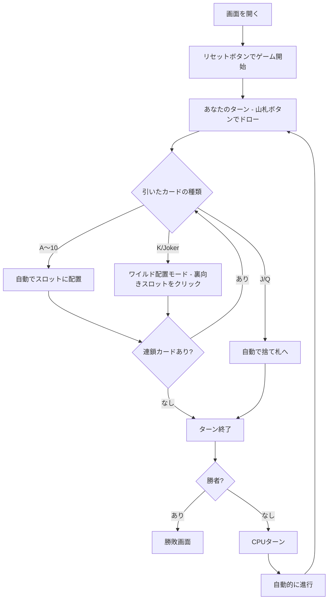

# トラッシュ（Web版）遊び方

## ゲーム概要

「Trash（トラッシュ / ガベージ）」は、山札から引いたカードを自分の前に並んだ10枚のスロットと交換しながら、1〜10のカードを先にすべて表向きに揃えることを目指す対戦型カードゲームです。本実装では人間1人 対 CPU1人の2人対戦を採用しています。

## 起動方法

```sh
go run ./cmd/trumpcards web
go run ./cmd/server
```

ブラウザで `http://localhost:8080` にアクセスし、ナビゲーションバーから「Trash（トラッシュ）」を選択します。
ナビバーのJA/ENボタンで日本語・英語を切り替えられます。

## ルール

### 基本ルール

- 52枚の標準デッキ＋ジョーカー2枚＝計54枚を使用。
- 各プレイヤーの前に10枚のカードを裏向きで並べる（ポジション1〜10）。
- 手番プレイヤーは山札から1枚引き、
  - A〜10は対応するポジションに配置（そこにあった裏向きカードを取り上げてチェーン継続）。
  - K または Joker はワイルドとして任意の空きスロットに配置できる（手動で位置を選択）。
  - J または Q を引いたり、対応スロットが既に表向きの場合は捨て札に送られターン終了。
- 山札が尽きた場合は捨て札の一番上を残して残りをシャッフルし山札に戻す。

### ゲーム終了

- 10スロットすべてを表向きに揃えたプレイヤーの勝利。

## ゲームの流れ



## 画面の操作方法

### あなたのターン（playerTurn）

- 画面中央の山札ボタンをクリックすると1枚引かれ、可能なら自動でチェーンが解決される。
- ターン終了（J/Q / 既に表向きスロット）は自動的にCPUに手番が渡る。

### ワイルド配置（awaitWild）

- 「ペンディング」エリアに引いたK/Jokerが表示される。
- 画面下部の自分のスロット群から裏向きカード（`?` 表示）を1つクリックして配置。

### CPUターン（cpuTurn）

- CPUの操作は自動で進み、必要に応じて「CPUターンを進める」ボタンで手動ステップ実行もできる。

### ゲーム終了（gameOver）

- 勝敗メッセージと手数が表示される。「棋譜を表示」ボタンで対局ログを確認できる。
- 「リセット」でもう一度。

### キーボードショートカット

| キー | アクション | 有効条件 |
|------|-----------|---------|
| - | 現バージョンでは固有のショートカットなし | - |

## 画面構成

```
┌────────────────────────────────────────────┐
│ Trash (トラッシュ)   [CLI切替] [Tutorial]   │
│ 手数: 3    フェーズ: あなたのターン          │
├────────────────────────────────────────────┤
│ CPU (10スロット：2×5 裏向きグリッド)         │
├────────────────────────────────────────────┤
│ [山札 31]  [ペンディング: K♦]  [捨て札 2]    │
├────────────────────────────────────────────┤
│ あなた (10スロット：2×5 グリッド)            │
│   表向きになったカードが順次めくれる          │
├────────────────────────────────────────────┤
│ メッセージ / フッター（リセット / 棋譜 等）  │
└────────────────────────────────────────────┘
```

## 遊び方のコツ

- ワイルドは狙って置ける強力なカード。1〜10のチェーンがつながる位置を想定して選ぶとよい。
- CPUの捨て札がJ/Qばかりならチェーン機会を失っている合図。
- 捨て札の一番上はお互いが拾えない情報源。自分の残りスロットと突き合わせれば相手の進捗が見える。
