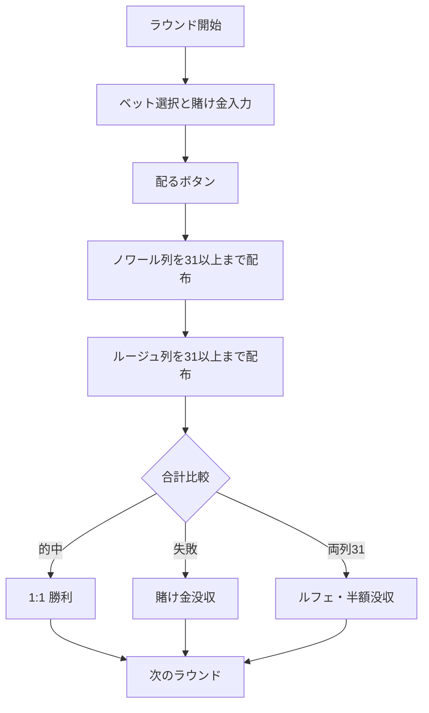

# トラント・エ・カラント（Web版）遊び方

## ゲーム概要

トラント・エ・カラント（Trente et Quarante、別名 ルージュ・エ・ノワール＝赤と黒）は、モンテカルロで生まれた古典的なバンキングゲームです。カードの操作は一切なく、4種類の等倍ベットから1つと賭け金を選ぶだけ。ディーラーが2列のカードを配り、合計が小さい列が勝ちます。ハウスエッジの低さから、上級者にも人気のゲームです。

## 起動方法

```sh
go run ./cmd/trumpcards web  # CLI経由でWebサーバーを起動
go run ./cmd/server          # 直接Webサーバーを起動
```

ブラウザで `http://localhost:8080` にアクセスし、ナビゲーションバーから「トラント・エ・カラント」を選択します。
ナビバーの JA/EN ボタンで日本語・英語を切り替えられます。

## ルール

### 基本ルール

1. 画面下部の4つのベットボタンから1つを選び、賭け金を入力して「配る」をクリックします。
   - **ノワール（Noir）**: 黒の列が勝つ（合計が小さい）方に賭ける。
   - **ルージュ（Rouge）**: 赤の列が勝つ方に賭ける。
   - **クルール（Couleur）**: 最初に配られたカードの色が勝ち色と一致する方に賭ける。
   - **アンヴェルス（Inverse）**: 最初のカードの色が勝ち色と一致しない方に賭ける。
2. ディーラーが **ノワール（黒）→ ルージュ（赤）** の順に、各列の合計が **31 以上** になるまでカードを配ります（絵札=10、A=1）。
3. 合計が **31 に近い（＝小さい）列が勝ち**。勝ち列は緑色の枠でハイライトされます。
4. ベットが的中すれば **等倍（1:1）**、外れれば賭け金を没収されます。
5. 両列がちょうど **31 で並ぶ** と **ルフェ（Refait）** となり、賭け金の **半分** を失います。

### 配当表

| 結果 | 配当 |
|------|------|
| ベット的中 | 賭け金に対して 1:1 |
| ベット失敗 | 賭け金を没収 |
| ルフェ（両列 31 で引き分け） | 賭け金の半分を没収 |

## ゲームの流れ



## 画面の操作方法

- **ベット選択**: ノワール／ルージュ／クルール／アンヴェルスのボタンをクリックして選択（選択中は強調表示）。
- **賭け金入力**: チップ額を入力します。
- **配る**: 「配る」ボタンで2列を配布して即座に判定します。
- **次のラウンド**: 結果表示後に「次のラウンド」をクリックして続行（チップは引き継がれます）。
- **再ベット**: 前回と同じベットをすぐに繰り返せます。
- キーボードショートカット: `d` 配る、`r` 次のラウンド、`e` 再ベット。

## 画面構成

- **フェーズ表示**: 現在のフェーズとチップ残高
- **2列のカード**: ノワール（黒）とルージュ（赤）の列、それぞれの合計値。勝ち列は緑枠で強調
- **結果表示**: 勝敗、ルフェ、収支を表示
- **ヒント**: ベット選択時に等倍ベットの案内を表示（オプション）

## 遊び方のコツ

- 4種類のベットはすべて等倍で、ハウスエッジも同一です。数学的にはどれを選んでも同じなので、伝統的に人気の **ノワール** が無難な選択です。
- ハウスエッジはルフェ由来のみで、カジノゲームの中でも屈指の低さです。
- ヒントを有効にすると、ベット選択時のガイドが表示されます。
