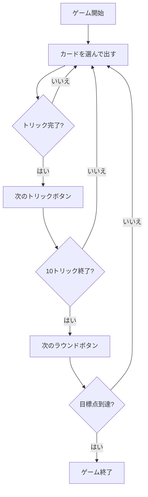

# トレセッテ（Web版）遊び方

## ゲーム概要

Tressette（トレセッテ）はイタリアの3大国民的カードゲームの一つで、切り札のない純粋なトリックテイキングゲームです。40枚デッキ（8・9・10を除く）を4人（2対2のチーム戦）に10枚ずつ配り切り、マストフォローの制約の中でパートナーと連携して得点札を奪い合います。カードの強さは「3 > 2 > A > K > Q > J > 7 > 6 > 5 > 4」、得点は1/3点刻みで数えます。先に目標点（既定21点）へ到達したチームの勝利です。

## 起動方法

```sh
go run ./cmd/trumpcards web        # REST API + Web GUI サーバを起動
go run ./cmd/trumpcards web --open # 起動してブラウザを開く
```

ブラウザで `/tressette` にアクセスします。

## ルール

### チーム

- あなた（プレイヤー0）とプレイヤー2がチームA、プレイヤー1とプレイヤー3がチームB。向かい合うプレイヤー同士が味方です。

### カードの強さ

切り札はありません。リードスートに従う義務（マストフォロー）があり、リードスートの最強札を出したプレイヤーがトリックを獲得します。

強い順: **3 > 2 > A > K > Q > J > 7 > 6 > 5 > 4**

### 得点（1/3点単位）

| カード | 得点 |
|--------|------|
| A | 1点 |
| 2・3・K・Q・J | 各 1/3点 |
| 7・6・5・4 | 0点 |
| 最終トリックの勝者 | +1/3点（ボーナス） |

ラウンド終了時に各チームの1/3点を3で割り（端数切り捨て）累積点へ加算します。目標点（既定21点）に先に到達し、相手を上回ったチームが勝者です。

## ゲームの流れ



## 画面の操作方法

- **設定パネル**: CPU難易度と目標点を選択できます。「ヒント」チェックでフロントエンドのヒント表示を切り替えられます。
- **カードを選ぶ**: あなたの手番のとき、手札のカードをクリックして選択します。リードスートに従えないカードはサーバ側で弾かれます。
- **「出す」ボタン**: 選んだカードをプレイします。
- **「次のトリック」ボタン**: トリックが解決したら次のトリックへ進みます。
- **「次のラウンド」ボタン**: ラウンド終了時に集計して次のラウンドへ進みます。
- **「ヒント」ボタン**: 現在の手番での推奨プレイを表示します。
- **リセットボタン**: 新しいゲームを開始します。

## 画面構成

- **ヘッダー**: ゲーム名・フェーズ表示・CLI切り替えトグル。
- **ラウンド／トリック表示**: 現在のラウンドとトリック番号。
- **トリック表示エリア**: 場に出ているカードと出したプレイヤー。
- **チームスコア表**: チームA／Bの累積点と現ラウンドの1/3点。
- **メッセージボックス**: 現在のフェーズや結果の案内。
- **フッター**: あなたの手札と操作ボタン。

## 遊び方のコツ

- A・2・3 は強い札であると同時に得点札です。取られないよう注意しましょう。
- 味方がトリックで勝っているときは、得点札を出して味方に点を渡すのが定石です。
- 相手が勝っていて得点札が出ているなら、勝てる札で取りに行きます。取れないときは低い札でダックして温存します。
- 最終トリックには +1/3点 のボーナスがあります。
