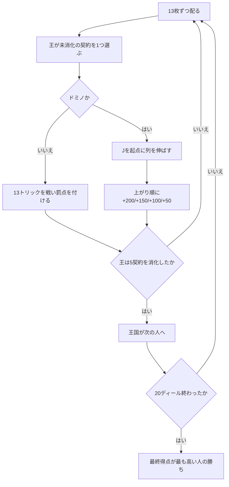

# トリックス (Trex) — Web マニュアル

## ゲーム概要

レバノン・ヨルダン・エジプトなど中東で遊ばれる**契約選択型**のトリックテイキング。52 枚、4 人**個人戦**、**20 ディール**（4 王国 × 5 契約）で戦います。

各プレイヤーが順に「王」となり、5 種の契約から**まだ自分が選んでいないもの**を 1 つ選びます。4 つは罰点、1 つ（ドミノ）は**加点**です。

実装は [pagat.com の Trix](https://www.pagat.com/compendium/trex.html) に従います。

## 起動方法

1. `go run ./cmd/trumpcards web` でサーバーを起動します
2. ブラウザで `http://localhost:8080` を開きます
3. ゲーム一覧から **トリックス** を選ぶか、`/trex` へ直接アクセスします

## ルール

- **デッキ**: 52 枚 / **4 人個人戦** / 各自 13 枚
- **♥7 を配られた人が最初の王**です。王は 5 ディール続けて契約を選び、その後は王国が次の人へ移ります
- 同じ王が**同じ契約を二度選ぶことはできません**

### 5 種の契約

| 番号 | 契約 | 内容 |
|---|---|---|
| `0` | **♥K**（Sheikh Koobbah） | ♥K を含むトリックを取った人が **−75**。取られた時点でそのディールは終わります |
| `1` | **ダイヤ**（Dinari） | 取った ♦ 1 枚につき **−10**（13 枚で −130） |
| `2` | **クイーン**（Banat） | 取った Q 1 枚につき **−25**（4 枚で −100） |
| `3` | **トリック**（Eltoosh） | 取ったトリック 1 つにつき **−15**（13 トリックで −195） |
| `4` | **ドミノ**（Trex） | トリックを取らない。**J を起点**に列を伸ばし、上がり順に **+200 / +150 / +100 / +50** |

### ドミノ（Trex）の出し方

- 場は**スートごとに 4 列**あり、どの列も **J から始まります**
- 合法手は「**任意の J**」または「**既に出ている札の 1 つ上か下**（同じスート）」
- 列は J から上へ Q → K → A、下へ 10 → 9 → … → 2 と伸びます
- 出せる札が 1 枚も無ければ**パス**します（出せるときはパスできません）
- 手札を先に出し切った順に **+200 / +150 / +100 / +50**

### 罰点と加点は釣り合います

- 罰点契約の合計: 75 + 130 + 100 + 195 = **500**
- ドミノの配点: 200 + 150 + 100 + 50 = **500**

**1 王国（5 ディール）がちょうどゼロサム**なので、20 ディール終了時の全員の合計は 0 になります。

### 勝敗

20 ディール終了後、**最終得点が最も高い人が勝ち**です。ドミノで加点されるため、正の点もありえます。

## ゲームの流れ

## 画面の操作方法

| 操作 | 説明 |
|------|------|
| **契約** ボタン | 王のとき、まだ選んでいない契約だけがボタンとして並びます |
| 手札のカードをクリック | その札を出します（出せる札だけが選択可能になります） |
| **パス** ボタン | ドミノで出せる札が 1 枚も無いときだけ押せます |
| **次のディール** ボタン | 精算を読んだあと、次のディールへ進みます |
| **ヒント** トグル | 推奨する手をハイライトします |
| **設定** パネル | CPU 難易度を変更してリセットします |
| **CLI** トグル | ターミナル風の操作に切り替えます |

## 画面構成

- **ヘッダー**: ディール数（`n/20`）、王の席、現在の契約
- **ルール表示**: 常時表示します。「同じ契約は 1 王国に 1 度だけ」「ドミノは J 起点」が最も間違えやすい 2 点です
- **契約の選択肢**: 王のときだけ現れ、**消化済みの契約は出ません**
- **場**: トリック契約では現在のトリック、ドミノ契約では**4 スートの列**（どこまで伸びたか）
- **プレイヤー**: 累計得点と今ディールの得点。全員ぶん公開されます
- **手札**: 自分の手札。出せる札だけが選択可能です。CPU の手札は裏向きで枚数のみ
- **アクションログ**: 進行を後から追えます

## 遊び方のコツ

- **王のときが攻めどころです。**自分の手札に合った契約を選べます。♦ が少ないならダイヤ契約、短いスートが多いならトリック契約が楽です
- **♥K 契約は 1 枚勝負**です。♥ が短ければ ♥K を押し付けられる危険が小さくなります
- **ドミノは J が命**です。J を持っていれば列を開けるので主導権を握れます。逆に J が 1 枚も無いと、序盤はパスが続きます
- ドミノで**端の札（A や 2）を早く出す**と、後半に詰まりにくくなります
- 罰点契約では**リードのスートに追随できない札**が逃げ道です。短いスートを早めに空けておくと、罰点札を押し付けられにくくなります
