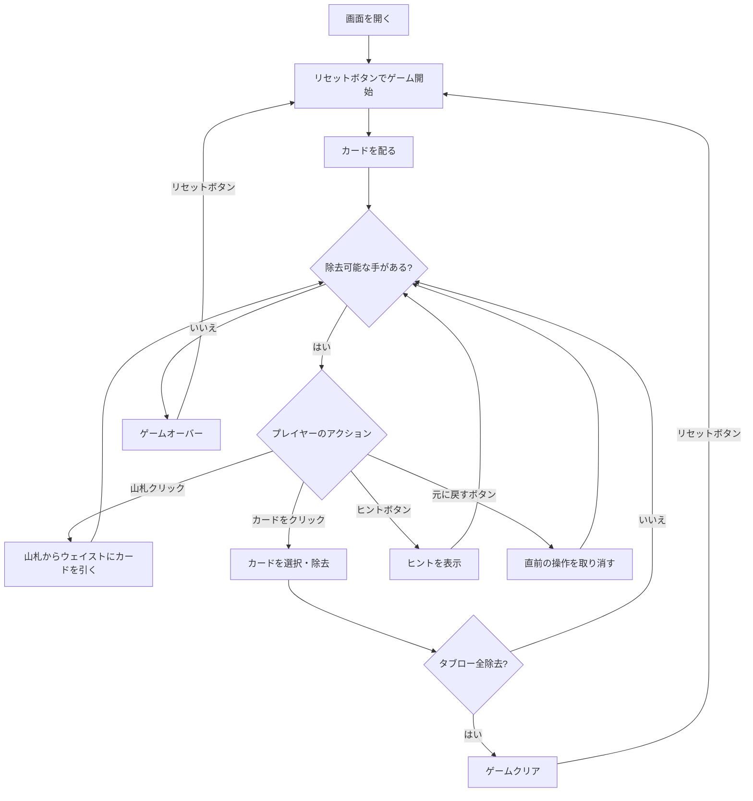

# トリピークス（Web版）遊び方

## ゲーム概要

1人用のソリティアカードゲームです。52枚のカードを使い、3つの重なり合うピラミッド（ピークス）に並べた28枚のカードから、ウェイストのトップカードと±1のランクのカードを除去していきます。タブローのカードをすべて除去すればクリアです。

## 起動方法

```sh
go run ./cmd/trumpcards web     # CLI経由でWebサーバーを起動
go run ./cmd/server              # 直接Webサーバーを起動
```

ブラウザで `http://localhost:8080` にアクセスし、ナビゲーションバーから「トリピークス」を選択します。
ナビバーのJA/ENボタンで日本語・英語を切り替えられます。

## ルール

### 基本ルール

- 52枚のトランプ（ジョーカーなし）を使用
- 3つの重なり合うピラミッド型に28枚を配る
- 残りの24枚のうち1枚をウェイストに、23枚を山札（ストック）に置く
- 「露出カード」（下の段のカードが除去済み）のみ選択可能

### 除去ルール

- ウェイストのトップカードと±1のランクのカードを除去できる
- K-Aは繋がる（ラップアラウンド）：KからAへ、AからKへ除去可能
- 例：ウェイストが5なら、4または6を除去できる

### ゲームクリア

- タブローの28枚すべてを除去するとゲームクリア

### ゲームオーバー

- これ以上除去可能な手がない場合はゲームオーバー

### 手詰まり検出

- ヒントが存在せず、かつ山札が空の場合に「手詰まりです」とメッセージが表示されます
- 手詰まり状態では「元に戻す」またはギブアップを選択できます

## ゲームの流れ



## 画面の操作方法

### カードを除去する

1. 露出カードをクリックして除去します（ウェイストトップと±1のランクである必要あり）
2. K-Aのラップアラウンドも有効です

### 山札を引く

1. 山札エリアをクリックしてカードをウェイストに引きます
2. 山札が空になると引けなくなります

### アンドゥ（元に戻す）

**「元に戻す」** ボタンまたは `z` キーで直前の操作を取り消せます。何度でも元に戻せます。

### ヒント

**「ヒント」** ボタンをクリックすると、次に可能な手を提案します。

### キーボードショートカット

ゲーム中、以下のキーボードショートカットが使用できます。

| キー | アクション | 有効条件 |
|------|-----------|---------|
| `d` | カードを引く（ドロー） | プレイ中 |
| `z` | 元に戻す（アンドゥ） | プレイ中 |
| `h` | ヒント | プレイ中 |
| `g` | ギブアップ | プレイ中 |

※ テキスト入力欄にフォーカスがある場合、ショートカットは無効になります。

## 画面構成

```
┌────────────────────────────────────────────┐
│              ゲーム情報                     │
│  手数: 0                                   │
├────────────────────────────────────────────┤
│           タブローエリア                    │
│    [♥A]      [♦K]      [♣7]              │
│   [♠3] [♥8] [♦2] [♣9] [♠6] [♥Q]        │
│  [♦4] [♣J] [♠10] ... [♥9] [♦8]          │
│ [♣5] [♠K] [♥7] ... [♣4] [♠9]            │
├────────────────────────────────────────────┤
│  山札・ウェイストエリア                    │
│  [山札: 23枚] [ウェイスト: ♠5]            │
├────────────────────────────────────────────┤
│  [引く] [元に戻す] [ヒント]               │
│  [ギブアップ] [リセット]                  │
└────────────────────────────────────────────┘
```

- **タブローエリア**: 3つの重なり合うピラミッド型にカードを表示
  - 露出カード: クリックで除去可能（明るく表示）
  - 非露出カード: クリック不可（暗く表示）
  - 除去済み: 空白表示
- **山札エリア**: クリックでカードをウェイストに引く（残りカード数表示）
- **ウェイストエリア**: 引いたカードが表示される（±1のランクのカードを除去する基準）
- **ボタン**:
  - 「引く」: 山札からカードを引く
  - 「元に戻す」: 直前の操作を取り消す
  - 「ヒント」: 次の一手を提案
  - 「ギブアップ」: 現在のゲームを終了
  - 「リセット」: 新しいゲームを開始

## 遊び方のコツ

- ウェイストのトップカードから連続して除去できるチェーンを狙いましょう
- K-Aのラップアラウンドを活用して長いチェーンを作りましょう
- 上段のカードを露出させるために、下段のカードを優先的に除去します
- 山札を引く前に、タブロー内で除去できるカードがないか確認しましょう
- ヒントボタンで詰まった時のアドバイスを得られます
- アンドゥを活用して、異なる戦略を試しましょう
