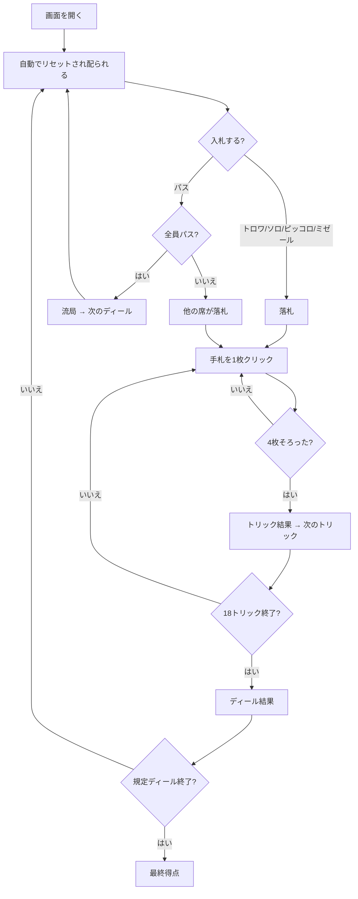

# トロッグ（Web版）遊び方

## ゲーム概要

トロッグ（Troggu）はスイス・ヴァレー州に伝わるタロー系トリックテイキングです（4人：あなた + CPU3人）。タロー78枚を使い、**契約ごとに「勝ち」の意味が変わる**のが骨格です ── ソロは点数の過半、トロワは3トリック、ピッコロはちょうど1トリック、ミゼールは1つも取らないこと。

## 起動方法

```sh
go run ./cmd/trumpcards web  # CLI経由でWebサーバーを起動
go run ./cmd/server          # 直接Webサーバーを起動
```

ブラウザで `http://localhost:8080` にアクセスし、ナビゲーションバーから「トロッグ」を選択します。
ナビバーのJA/ENボタンで日本語・英語を切り替えられます。

## ルール

### デッキと配布

- **デッキ**: タロー78枚（スート札56枚 + アトゥ21枚 + エクスキューズ1枚）。
- **配布**: 各席に **18枚**、残り **6枚**が場札（落札者の得点になります）。

### 契約

| 契約 | 目標 | 倍率 |
|------|------|------|
| トロワ | 3トリック以上 | ×1 |
| ソロ | カードポイントの過半 | ×2 |
| ピッコロ | ちょうど1トリック（多くても失敗） | ×3 |
| ミゼール | 1トリックも取らない | ×4 |

- 高い契約が優先します。どの契約も単独で3人と戦い、成功／失敗とも3人ぶんを受け取り／払います。
- **全員パスなら流局**。トリックを打たずに次のディールへ進み、得点は動きません。

### プレイと精算

- リードスートに従い、持っていなければアトゥを出します。エクスキューズはいつでも出せます。
- 18トリック後、契約ごとの目標と実際を比べて精算します（ゼロサム）。
- 規定ディール（1〜12、既定4）後に通算最多の席が勝ちです。

## ゲームの流れ



## 画面の操作方法

### 入札フェーズ

1. 「トロワ」「ソロ」「ピッコロ」「ミゼール」「パス」から選びます。
2. CPU の入札は自動で進み、あなたの番で止まります。

### プレイフェーズ

1. 手札をクリックするとその場で出ます。出せない札は薄く表示され、押しても送られません。
2. 4枚そろうと勝者が表示されるので、「次のトリック」で進みます。

### 結果

- ディール終了で結果が出ます。**契約によって単位が変わります** ── ソロは「◯点（必要◯点）」、他は「◯トリック（目標◯）」。
- 「次のディール」で続けます。規定ディール後に最終得点が出ます。

### 設定

| 設定 | 範囲 | 説明 |
|------|------|------|
| CPU難易度 | Easy / Normal / Hard | Easy はランダムに打ちます |
| ディール数 | 1〜12 | 何ディールで決着するか |

### キーボードショートカット

| キー | アクション | 有効条件 |
|------|-----------|---------|
| Tab | 次の札へフォーカス移動 | 常時 |
| Enter / Space | フォーカス中の札を出す | 自分の手番 |

## 画面構成

```
┌────────────────────────────────────────────┐
│ トロッグ                                   │
│ ディール 1/4  トリック 5  契約: ミゼール   │
├────────────────────────────────────────────┤
│ あなた（デクレアラー） CPU1  CPU2  CPU3    │
│ 手札14枚 トリック0     …     …     …       │
├────────────────────────────────────────────┤
│              現在のトリック                │
│         [札] [札] [札]                     │
├────────────────────────────────────────────┤
│            あなたの手札（14枚）            │
│  [札] [札] [札] [札] [札] [札] [札] ...    │
├────────────────────────────────────────────┤
│  [次のトリック]              [リセット]    │
└────────────────────────────────────────────┘
```

- 上段が席の一覧。**相手の手札は届きません**（枚数・トリック数・取った点だけ）。
- ミゼール／ピッコロでは「トリック0」が良い状態です。読み方が他の契約と逆になります。

## 遊び方のコツ

- **ミゼールは弱い手でこそ。** 絵札もアトゥも無い手なら1つも取らずに済みます。倍率は最高（×4）です。
- **ピッコロは0でも失敗。** ちょうど1トリックなので、どこで取るかを決めてから宣言します。
- **ソロは高いアトゥの枚数で決める。** 1人で過半の点を取るにはリードを握り続ける必要があります。
- 迷ったらパス。全員パスなら流局で、誰も失点しません。
