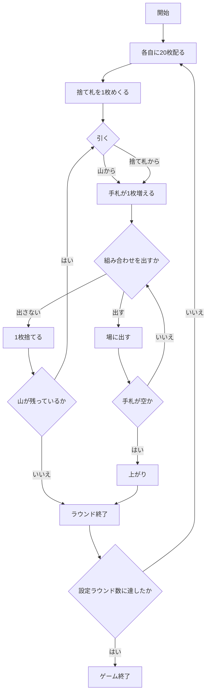

# トゥーサック（Web版）遊び方

## ゲーム概要

トゥーサック（四色牌 / Tứ Sắc）は、ベトナム南部で遊ばれるラミー系のゲームです。

**使うのはトランプ 52 枚ではなく、四色牌 112 枚**（4 色 × 7 種 × 4 枚）です。

- **4 色**: 黄・赤・緑・白
- **7 種**: 將・士・象・車・馬・砲・卒（将棋の駒と同じ名前）

**数字の大小という概念がありません。** そのため、ふつうのラミーにある「同じスートの連番」に当たる組み合わせが存在せず、作れるのは次の 3 つだけです。

| 組み合わせ | 内容 | 得点 |
|-----------|------|------|
| 卒5枚 | 卒を 5 枚（色は問わない） | **5 点** |
| 異色の車馬砲 | 車・馬・砲を 1 枚ずつ、**3 色とも違う色**で | **3 点** |
| 同色同種3枚 | 同じ色・同じ駒を 3 枚 | **2 点** |

## 起動方法

```sh
go run ./cmd/trumpcards web  # CLI経由でWebサーバーを起動
go run ./cmd/server          # 直接Webサーバーを起動
```

サーバ起動後、ブラウザで `http://localhost:8080/tusac` を開きます。

## ルール

- 四色牌 112 枚。2〜4 席（既定 4 席）で、席 0 があなたです。
- 各自に **20 枚**配り、残りが山になります。捨て札は 1 枚めくって始めます。
- 手番では **1 枚引いて、1 枚捨てます**。
  1. **引く**: 山から（`draw`）か、捨て札の一番上を拾う（`take`）
  2. **出す**（任意）: 組み合わせを場に出す（`meld`）。何度でも出せます
  3. **捨てる**: 手札から 1 枚（`discard`）
- **出した組み合わせは戻せません。** 場に出た札は別の組み合わせに使えなくなるので、「出さずに残す」判断がこのゲームの読みどころです。
- **手札を出し切ったら上がり**です。捨てる札が残らないので、その時点でラウンドが終わります。
- **山が尽きてもラウンドが終わります。** 上がりは手札 21 枚をちょうど使い切る必要があり滅多に出ないので、実際はほとんどこちらで終わります。
- **得点 = 出した組み合わせの合計 − 手に残った枚数**。抱えたままだと減点です。
- 設定ラウンド数（既定 5）を終えると、通算得点のいちばん高い席が勝ちです。

### 異色の車馬砲について

**「異色」と「3 種そろい」の両方が必要**です。

- 赤車・緑馬・白砲 → **成立**
- 赤車・赤馬・赤砲 → 不成立（同じ色）
- 赤車・緑車・白馬 → 不成立（車が 2 枚で、砲がない）

## ゲームの流れ



## 画面の操作方法

| 操作 | 説明 |
|------|------|
| 「山から引く」 | 山から 1 枚引きます |
| 「捨て札を拾う」 | 捨て札の一番上を取ります。何が取れるかは画面に出ています |
| 札を選んで「場に出す」 | 選んだ札が組み合わせなら場に出ます。組み合わせでなければ断られます |
| 札を選んで「捨てる」 | 手札から 1 枚捨てて手番を渡します |
| 「次のラウンドへ」 | 決着後、次のラウンドを始めます |
| ヒントボタン | いまの場面の定石を表示します |
| 棋譜ボタン | これまでの行動ログを表示します |
| リセットボタン | ゲームを最初からやり直します |

**押せる手はサーバが決めています。** 引く場面と捨てる場面で出るボタンが変わるので、押せないときはボタンが出ません。

## 画面構成

- **ラウンド表示**: 何ラウンド目か / 全体で何ラウンドか
- **山と捨て札**: 残り枚数と、捨て札の一番上の札
- **席の一覧**: 名前・手札の枚数・通算得点。**相手の手札は最後まで見えません**。場に出た組み合わせは全員ぶん見え、それぞれの得点も出ます
- **自分の手札**: すべて表示されます。札を選んで「場に出す」「捨てる」を押します
- **組み合わせの一覧**: 卒5枚 / 異色の車馬砲 / 同色同種3枚と、それぞれの得点
- **決着**: 各席のメルド点・手残り・差し引き。上がった席には印が付きます

## 遊び方のコツ

- **相手の場を見てください。** 手札は見えませんが、出した組み合わせは見えます。相手が卒を集めているなら、卒は捨てにくくなります。
- **出すのを我慢する判断があります。** 同色同種 3 枚（2 点）をすぐ出すと、その札が卒 5 枚（5 点）や車馬砲（3 点）に使えなくなることがあります。
- **抱えすぎると減点です。** 手に残った枚数がそのまま引かれるので、組み合わせにならない札は早めに手放してください。
- **上がりはほとんど出ません。** 21 枚をちょうど使い切る必要があるので、実際は山が尽きたときの得点勝負になります。
