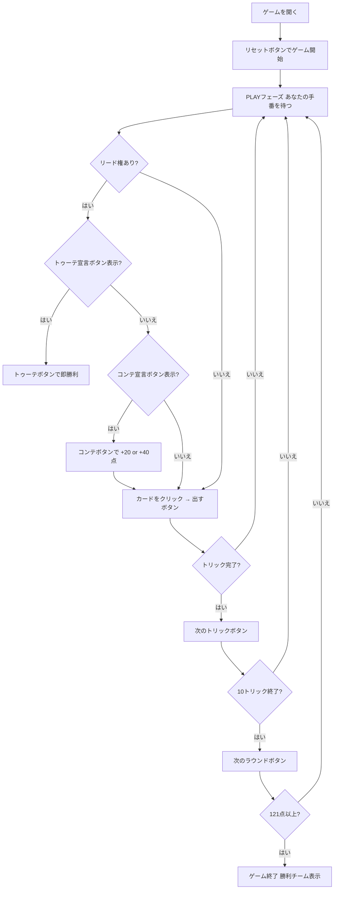

# トゥーテ（Web版）遊び方

## ゲーム概要

Tute（トゥーテ）はスペインで広く親しまれているトリックテイキングゲームです。40枚のラテンデッキを4人（2チーム制、席0&2 対 席1&3）でプレイします。切り札スートは配布時に決まり、マスト・フォロー制で10トリックを争います。「コンテ（cante）」宣言やインスタント勝利の「トゥーテ」宣言を活用しながら、先にターゲット点（デフォルト121点）に達したチームが勝ちます。あなたは席0（チームA）としてプレイします。

## 起動方法

```sh
go run ./cmd/trumpcards web        # REST API + Web GUI サーバを起動
go run ./cmd/trumpcards web --open # 起動してブラウザを開く
```

ブラウザで `/tute` にアクセスします。

## ルール

### デッキと配布

- **デッキ**: 40枚（A, 2〜7, Sota（J相当）, Caballo（Q相当）, Rey（K相当）× 4スート）
- **プレイヤー**: 4人（あなた = 席0、CPU1〜3）
- **チーム**: 席0&2（あなたのチーム）対 席1&3
- **配布**: 各プレイヤー10枚
- **切り札**: 最後に配られたカードのスートが切り札スートとなる

### カードの強さと点数

同スート内の強さ（強い順）: **A > 3 > Rey(K) > Caballo(Q) > Sota(J) > 7 > 6 > 5 > 4 > 2**

カード点数: **A=11点、3=10点、Rey=4点、Caballo=3点、Sota=2点、その他=0点**（合計120点 + 最終トリック +10点）

### マスト・フォロー

リードされたスートが手札にある場合は必ずそのスートを出さなければなりません。持っていない場合は任意のカードを出せます。

### コンテ（cante / 結婚宣言）

リード権を持つプレイヤーが同じスートの **Rey と Caballo** を両方持つ場合に宣言できます:

- **非切り札のコンテ**: チームに **+20点**
- **切り札のコンテ**: チームに **+40点**
- 各スートにつき1ラウンド1回まで

### トゥーテ（tute / インスタント勝利）

**4枚のRey全部**または**4枚のCaballo全部**を手札に持つ場合、「トゥーテ」を宣言すると**即座にゲーム勝利**となります。

### 勝利条件

累積スコアが先に **121点以上** に達したチームが勝利します（デフォルト目標）。

## ゲームの流れ



## 画面の操作方法

### PLAYフェーズ

- あなたの手番のとき、手札のカードをクリックして選択します。
- **「出す」ボタン**: 選択したカードをプレイします。リードスートに従う義務があります。
- **「コンテ」ボタン**: リード権時にReyとCaballoを同じスートで持っている場合のみ有効。クリックするとコンテ（+20点または切り札は+40点）を宣言します。
- **「トゥーテ」ボタン**: 4枚のRey全部または4枚のCaballo全部を持つ場合のみ有効。クリックすると即座にゲームが終了します。
- **「次のトリック」ボタン**: トリックが解決したら次へ進みます。
- **「次のラウンド」ボタン**: 10トリック終了後に得点を集計して次のラウンドへ進みます。

### キーボードショートカット

このゲームではキーボードショートカットはありません。すべての操作はボタンまたはカードのクリックで行います。

## 画面構成

```
┌─────────────────────────────────────────────┐
│  Tute (トゥーテ) [JA/EN] [CLI]             │
├─────────────────────────────────────────────┤
│  ラウンド: 1  トリック: 1  フェーズ: PLAY    │
│  切り札: ♥  チームスコア: あなた=0 相手=0    │
├──────────┬──────────────────────────────────┤
│  CPU1    │                                   │
│  CPU2    │     現在のトリック表示エリア       │
│  CPU3    │     （各プレイヤーの出したカード）  │
│          │                                   │
├──────────┼──────────────────────────────────┤
│  チームA │  メッセージ / 結果表示            │
│  チームB │  コンテ・トゥーテ宣言情報         │
├──────────┴──────────────────────────────────┤
│  あなたの手札（クリックで選択）               │
│  [A♠][3♠][Rey♥][Caballo♥][Sota♣]...       │
│  [出す] [コンテ] [トゥーテ] [次のトリック] [次のラウンド] │
└─────────────────────────────────────────────┘
```

- **ヘッダー**: ゲーム名・フェーズ表示・言語切り替えトグル・CLI切り替えトグル。
- **ラウンド／トリック表示**: 現在のラウンド番号・トリック番号・切り札スート。
- **チームスコア**: 各チームの累積点数をリアルタイムで表示。
- **プレイヤー表示エリア（左）**: CPU各プレイヤーの手札枚数・取得トリック数・チームを表示。
- **トリック表示エリア（中央）**: 場に出ているカードと出したプレイヤー名。
- **メッセージボックス**: フェーズ・コンテ／トゥーテ宣言結果・勝敗の案内。
- **フッター（手札エリア）**: あなたの手札と操作ボタン（出す／コンテ／トゥーテ／次へ）。

## 遊び方のコツ

- **切り札の温存**: 切り札のAや3は最も強力です。高得点カードを含むトリックを取るために温存しましょう。
- **コンテのタイミング**: ReyとCaballoを同スートで揃えたらリード権時にコンテが宣言できます。切り札コンテ（+40点）は大きなアドバンテージです。
- **トゥーテ狙い**: 4枚のReyまたは4枚のCaballoを集めると即勝利できます。相手チームのReyやCaballoを意識的に取りに行きましょう。
- **チームプレイ**: 席0&2が同じチームです。パートナーが高得点トリックを取る局面では低いカードで協力しましょう。
- **最後のトリック（+10点）**: 最後（10枚目）のトリックには+10点が加算されます。終盤は最後のトリック獲得も意識した手作りが重要です。
- **点数管理**: A（11点）と3（10点）が最も高価なカードです。これらを含むトリックを取ることが勝利への近道です。
- **マスト・フォローの活用**: 相手にスートを持たせないよう、少ないスートから先に消費させましょう。スートが切れると自由に切り札を使われてしまいます。
