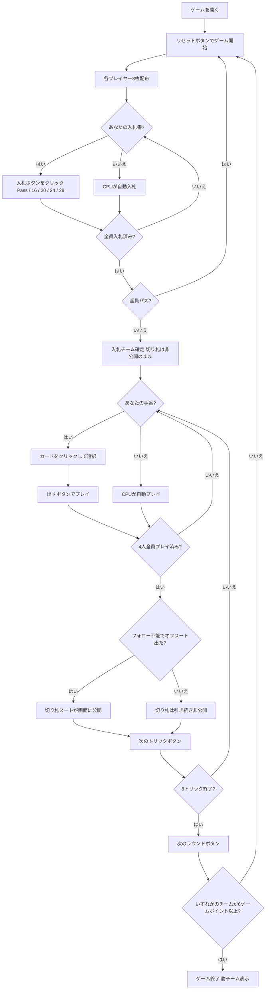

# トゥエンティナイン (29)（Web版）遊び方

## ゲーム概要

Twenty-Nine（トゥエンティナイン / 29）は南アジア（インド・バングラデシュ等）で広く親しまれているトリックテイキングゲームです。32枚のデッキを4人2チーム（席0&2 vs 席1&3）でプレイします。各ラウンドの最初に**入札フェーズ**があり、最高入札チームが**隠し切り札**を宣言してトリックを争います。カード得点の合計（最大29点）を巡る駆け引きが特徴です。先に**6ゲームポイント**を獲得したチームの勝利です。あなたは席0（チームA）としてプレイします。

## 起動方法

```sh
go run ./cmd/trumpcards web         # CLI経由でWebサーバーを起動
go run ./cmd/trumpcards web --open  # サーバー起動 + ブラウザを開く
go run ./cmd/server                 # 直接Webサーバーを起動
```

ブラウザで `http://localhost:8080` にアクセスし、ナビゲーションバーから「トゥエンティナイン (29)」を選択します。
ナビバーのJA/ENボタンで日本語・英語を切り替えられます。

## ルール

### デッキと配布

- **デッキ**: 32枚（7,8,9,10,J,Q,K,A × 4スート）
- **プレイヤー**: 4人2チーム（あなた = 席0・チームA、席0&2 vs 席1&3）
- **配布**: 各プレイヤー8枚、計8トリック

### カードの強さとカード得点

| 強さ順 | カード | カード得点 |
|--------|--------|------------|
| 1位 | J（ジャック） | 3点 |
| 2位 | 9（ナイン） | 2点 |
| 3位 | A（エース） | 1点 |
| 4位 | 10（テン） | 1点 |
| 5位以下 | K / Q / 8 / 7 | 0点 |

カード得点の合計は**28点**。最終トリック（8トリック目）を取ったチームに **+1点** が加わり、1ラウンドの争いは合計**29点**です。切り札はすべての非切り札を上回り、スート内の強さはこの表の順です。

### 入札フェーズ

ディーラーの左隣から時計回りに、各プレイヤーが1回だけ入札します。

| 入札 | 内容 |
|------|------|
| **Pass（パス）** | 入札をパスする |
| **16** | チームとして16点以上取ることを宣言 |
| **20** | チームとして20点以上取ることを宣言 |
| **24** | チームとして24点以上取ることを宣言 |
| **28** | チームとして28点以上取ることを宣言（最高入札） |

- パス以外の入札は、現在の最高入札を上回らなければなりません（16 < 20 < 24 < 28）。
- 全員がパスした場合はそのラウンドは無効となり、再配布されます。
- 最高入札者のチームが**入札チーム**となり、入札者の最長スートが自動的に切り札スートに決まります。

### 隠し切り札（Hidden Trump）

- 切り札スートはラウンド開始直後には公開されません。画面上は「非公開」と表示されます。
- **公開条件**: いずれかのプレイヤーがリードスートに追従できず、切り札以外のカードを出した瞬間に切り札スートが全員に公開されます。

### 勝利条件

- 入札チームが入札値以上のカード得点を取った場合 → 入札チームが **1ゲームポイント** を獲得。
- 入札チームが入札値を下回った場合 → 非入札チームが **1ゲームポイント** を獲得。
- 先に**6ゲームポイント**に達したチームがマッチ勝利。

## ゲームの流れ



## 画面の操作方法

### BIDフェーズ（入札フェーズ）

あなたの入札番になると、手札の下に入札ボタンが表示されます。

- **「Pass」ボタン**: 入札をパスします。
- **「16」ボタン**: 16点入札を宣言します。先行入札が16以上の場合はグレーアウトして選択できません。
- **「20」ボタン**: 20点入札を宣言します。先行入札が20以上の場合は選択できません。
- **「24」ボタン**: 24点入札を宣言します。先行入札が24以上の場合は選択できません。
- **「28」ボタン**: 28点入札（最高入札）を宣言します。先行入札が28の場合は選択できません。

### PLAYフェーズ（トリックフェーズ）

- あなたの手番のとき、手札のカードをクリックして選択します。
- **「出す」ボタン**: 選択したカードをプレイします。スートフォロー義務に従う必要があります（義務に反するカードは選択できません）。
- **「次のトリック」ボタン**: トリックが解決したら次へ進みます。切り札が公開されている場合は画面の切り札表示が更新されます。
- **「次のラウンド」ボタン**: 8トリック終了後にゲームポイントを集計して次のラウンドへ進みます。

## 画面構成

```
┌─────────────────────────────────────────────────────────┐
│  Twenty-Nine / 29 (トゥエンティナイン) [JA/EN] [CLI]     │
├─────────────────────────────────────────────────────────┤
│  ラウンド: 1  トリック: 0  フェーズ: BID                 │
│  切り札: 非公開  入札チーム: -  入札値: -                │
│  チームA(あなた)=0  チームB=0                            │
├──────────┬──────────────────────────────────────────────┤
│  CPU1    │                                               │
│  (チームB)│     現在のトリック表示エリア                  │
│  CPU2    │     （各プレイヤーの出したカード）             │
│  (チームA)│                                               │
│  CPU3    │                                               │
│  (チームB)│                                               │
├──────────┼──────────────────────────────────────────────┤
│  入札状況│  メッセージ / 結果表示                        │
│  CPU1=?  │  ラウンド結果・ゲームポイント情報             │
│  CPU2=?  │                                               │
│  CPU3=?  │                                               │
├──────────┴──────────────────────────────────────────────┤
│  あなたの手札（クリックで選択）                           │
│  [J♠][9♣][A♥][10♦][K♠][Q♦][8♣][7♥]                  │
│  [Pass] [16] [20] [24] [28]        ← BIDフェーズ         │
│  [出す] [次のトリック] [次のラウンド] ← PLAYフェーズ     │
└─────────────────────────────────────────────────────────┘
```

- **ヘッダー**: ゲーム名・フェーズ表示・言語切り替えトグル・CLI切り替えトグル。
- **ラウンド／トリック表示**: 現在のラウンド番号・トリック番号・フェーズ・切り札スート（「非公開」または公開後のスート）・入札チームと入札値。
- **ゲームポイント**: 両チームの累積ゲームポイントをリアルタイムで表示。
- **プレイヤー表示エリア（左）**: CPU各プレイヤーの手札枚数・チーム（入札チームか非入札チームか）を表示。
- **入札状況（左）**: 各プレイヤーの入札内容（入札フェーズ中）。
- **トリック表示エリア（中央）**: 場に出ているカードと出したプレイヤー名。
- **メッセージボックス**: フェーズ・ラウンド結果（カード得点・ゲームポイント）・切り札公開通知・勝敗の案内。
- **フッター（手札エリア）**: あなたの手札と操作ボタン（BIDフェーズは入札ボタン5種、PLAYフェーズは出す／次のトリック／次のラウンド）。

## 遊び方のコツ

- **入札の判断**: J（3点）と9（2点）は高得点カード。これらを複数持っているときは積極的な入札を検討しましょう。特に同スートのJ+9は確実に2トリックを取れる見込みがあります。
- **隠し切り札を有効活用**: 切り札公開前は相手チームも切り札を知りません。入札画面でのボタン選択時に切り札スートが決まりますが、それが公開されるかどうかはゲームの展開次第です。公開が遅れるほど情報優位を保てます。
- **グレーアウトボタンを確認**: 入札フェーズで既に高い入札が出ている場合、それ以下のボタンはグレーアウトされます。残りの選択肢を確認してから入札しましょう。
- **最終トリック（+1点）を意識する**: 28点の均衡局面では最終トリックの+1点が勝負を分けます。得点カードを使い切った後半でも最終トリックを狙う意識を持ちましょう。
- **チームメイトとの連携**: チームメイト（席2のCPU）がリードしたトリックでは、得点カード（J・9・A・10）を積極的に投入してチームの得点を伸ばしましょう。
- **非入札チームの守り**: 非入札チームは入札チームが入札値を下回るよう妨害します。切り札スートが判明した後は、相手の高得点カード（J・9）を切り札で奪うことが最も効果的です。
