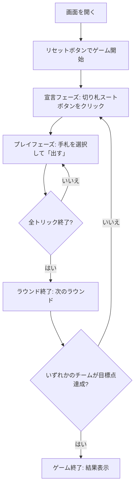

# ツーテンジャック（Web版）遊び方

## ゲーム概要

ツーテンジャックは日本生まれのトリックテイキングゲームで、2 人 vs 2 人のチーム戦です。席 0,2 が味方チーム、席 1,3 が相手チーム。宣言者は切り札スートを選び、1 ラウンド 13 トリックで A/J(各 1 点)・10(10 点)を奪い合います。累計で目標点に到達したチームが勝利します。

## 起動方法

```sh
go run ./cmd/trumpcards web       # CLI 経由で Web サーバーを起動
go run ./cmd/server               # サーバーを直接起動
```

ブラウザで `http://localhost:8080` を開き、ナビゲーションバーから「ツーテンジャック」を選択します。ナビバーの JA/EN ボタンで日英を切り替えられます。

## ルール

### 基本ルール

- プレイヤー: 人間1人 + CPU 3人、チーム (0,2) vs チーム (1,3)
- 配札: 各 13 枚
- 宣言者が切り札スート (♠/♣/♥/♦) を宣言
- リードに合わせてスートを出し、切り札 > リードスート > その他 の順で勝敗判定

### 得点

- A, J = 各 1 点 / 10 = 10 点 / 最終トリックボーナス = 2 点 / 合計 50 点
- 宣言チームが 26 点以上 → 成功、取得点 − 25 をスコア
- 26 点未満 → 失敗、相手チームに 26 − 取得点 をスコア

### ゲーム終了

- 累計スコアが目標点 (既定 50 点) 以上に達したチームが勝利

## ゲームの流れ



## 画面の操作方法

### 宣言フェーズ

あなたが宣言者の場合、画面下部に 4 つの切り札ボタン (♠/♣/♥/♦) が表示されます。ボタンをクリックして切り札スートを宣言します。

### プレイフェーズ

- 手札のカードをクリックして選択 (1枚だけ選択可)
- 「出す」ボタンを押してプレイ
- 選択を解除するには再度カードをクリック

### トリック終了 / ラウンド終了

各トリック終了後に「次のトリック」、ラウンド終了後に「次のラウンド」ボタンをクリックして進行します。

### 設定

設定パネルから CPU 難易度 (Easy / Normal / Hard) と目標スコア (30/50/75/100) を変更できます。変更後は「リセット」で適用されます。

### キーボードショートカット

| キー | アクション | 有効条件 |
|------|-----------|---------|
| ←/→ | 手札カーソル移動 | プレイフェーズ (自分のターン) |
| Enter / Space | 選択中カードを出す | プレイフェーズ (自分のターン) |
| Esc | 選択解除 | プレイフェーズ (自分のターン) |

## 画面構成

```
┌────────────────────────────────────────────┐
│  ツーテンジャック        [JA|EN] [☰]     │
├────────────────────────────────────────────┤
│  ラウンド 1  トリック 1  切り札: ♠       │
│  ┌─── 現在のトリック ───┐ ┌─ スコア ─┐  │
│  │   [♠A] [♥K] [♦10]    │ │ Your:  0 │  │
│  └─────────────────────┘ │ Opp:   0 │  │
│  CPU プレイヤー情報                       │
├────────────────────────────────────────────┤
│  [手札: ♠A ♥J ... ]                       │
│  [♠] [♣] [♥] [♦] [出す] [リセット]         │
└────────────────────────────────────────────┘
```

## 遊び方のコツ

- 切り札は自分の最長スートを選ぶのが基本
- 10 点カード (10) は序盤で捨てず、終盤で保持して得点化する
- 最終トリックを取るとボーナス 2 点がつくため、終盤に強いカードを残す
