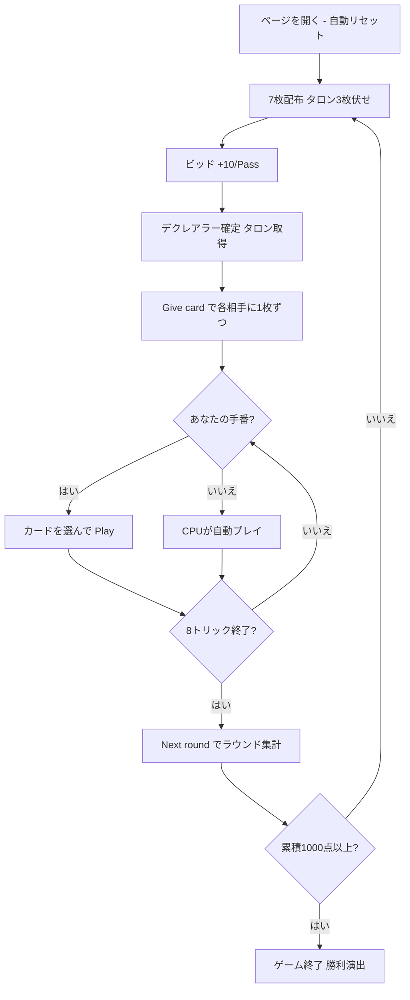

# トゥシオンツ（1000）（Web版）遊び方

## ゲーム概要

Thousand（Tysiąc / トゥシオンツ）はポーランドおよび東欧で広く親しまれている**ビッド式トリックテイキングゲーム**です。24枚デッキを3人でプレイし、各プレイヤーが個別に得点します（チームなし）。100点から始まるオークションで最後まで残ったプレイヤーが**デクレアラー**となり、宣言した**コントラクト**の達成を目指します。最初に累積**1000点**に達したプレイヤーがマッチ勝利です。あなたは席0としてプレイします。

## 起動方法

```sh
go run ./cmd/trumpcards web        # REST API + Web GUI サーバを起動
go run ./cmd/trumpcards web --open # 起動してブラウザを開く
```

ブラウザで `/tysiac` にアクセスします。

## ルール

### デッキと配布

- **デッキ**: 24枚（9, J, Q, K, 10, A × 4スート）
- **プレイヤー**: 3人（あなた = 席0、CPU1〜2）
- **配布**: 各プレイヤー7枚。残り**3枚はタロン（widow）**として伏せられます。

### ビッド（オークション）

開始額は **100**。前手から順に**+10刻みで上げる**か**パス**します。一度パスすると降りた扱いです。最後に残ったプレイヤーが**デクレアラー**となり、その額が**コントラクト**になります。全員即パスなら前手が100を引き受けます。

Web では **「+10 (Raise)」** と **「Pass」** のボタンで操作します。

### タロン交換

デクレアラーはタロン3枚を引き取り、各相手に1枚ずつ渡します。Web では渡すカードを選んで **「Give card」** ボタンを押す操作を2回行います。

### マリッジ（婚礼）＝ 動的切り札

リードの番で同一スートの **K と Q** を両方持っていれば、KまたはQをリードすることでマリッジを宣言でき、そのスートが**即座に切り札**になります（ラウンド開始時は切り札なし）。

| スート | マリッジ点 |
|--------|------------|
| ♠ スペード | 40点 |
| ♣ クラブ | 60点 |
| ♦ ダイヤ | 80点 |
| ♥ ハート | 100点 |

手札にマリッジ可能な組があると、フッターに候補がバナー表示されます。

### カードの強さ・点数

- **強さ**（切り札・非切り札共通）: A > 10 > K > Q > J > 9。切り札は非切り札に勝ちます。
- **カード点**: A=11, 10=10, K=4, Q=3, J=2, 9=0（合計120点）。

### フォロー義務

リードスートがあれば必ず従い、ボイド時は切り札を出します。場により高い切り札を持つ場合は勝てる札を出す**オーバートランプ義務**があります。

### 得点計算と勝利条件

各プレイヤーの合計 = カード点 + マリッジ点。デクレアラーは合計がコントラクト以上で **+コントラクト**、未満で **−コントラクト**。非デクレアラーは合計を**10単位に丸めて**加算。先に累積 **1000** 点で勝利。

## ゲームの流れ



## 画面の見方

- **ヘッダー**: ゲーム名・フェーズ表示（Bid / Talon / Play / …）・CLI 切り替え
- **情報サイドバー**: 各プレイヤーの累積得点・デクレアラーバッジ・コントラクト・現在のビッド・ラウンド結果
- **中央**: 現在のトリック
- **フッター**: あなたの手札（プレイ可能札がハイライト）・マリッジ候補バナー・アクションボタン（Raise/Pass/Give card/Play/Next/Next round/Reset）

## 遊び方のコツ

- 手札が強いときだけ高く張り、達成できそうにないコントラクトは避けましょう（失敗は−コントラクト）。
- ♥/♦ の高得点マリッジを狙い、KとQを揃えたらリードで宣言して切り札を握りましょう。
- タロン交換では点の低い札を相手に渡し、マリッジ素材のKとQは手元に残します。
- ヒント（設定でON）は、ビッド・タロン・プレイの各フェーズで推奨アクションを提示します。
