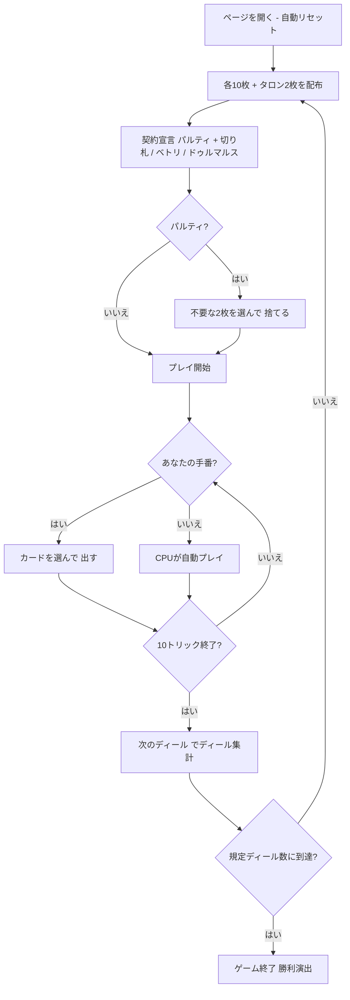

# ウルティ（Web版）遊び方

## ゲーム概要

Ulti（Ultimó / ウルティ）はハンガリー発祥の3人用**契約トリックテイキングゲーム**です。32枚デッキ（A, 10, K, Q, J, 9, 8, 7 × 4スート）を使い、あなたは**席0**として常に**デクレアラー（declarer）**となり、残り2人のCPUからなる**連合（coalition）**を相手に1人で10トリックを戦います。契約の成否に応じてコインをやり取りします。

## 起動方法

```sh
go run ./cmd/trumpcards web         # CLI経由でWebサーバーを起動
go run ./cmd/trumpcards web --open  # サーバー起動 + ブラウザを開く
go run ./cmd/server                 # 直接Webサーバーを起動
```

ブラウザで `http://localhost:8080` にアクセスし、ナビゲーションバーから「ウルティ」を選択します。
ナビバーのJA/ENボタンで日本語・英語を切り替えられます。

## ルール

### デッキと配布

- **デッキ**: 32枚（A, 10, K, Q, J, 9, 8, 7 × 4スート）。トリックの強さは **A＞10＞K＞Q＞J＞9＞8＞7**。
- **プレイヤー**: 3人（あなた = 席0 = デクレアラー、CPU1〜2 = 連合）
- **配布**: 各プレイヤー10枚＋場に伏せたタロン2枚。

### 契約（ビッド）

デクレアラーであるあなたは、**パルティ（Party）**・**ベトリ（Betli）**・**ドゥルマルス（Durchmarsch）**のいずれかを宣言します。

- **パルティ**: 得点（A・10 が各10点、最終トリック +10）で連合を上回る。切り札スート（♠♣♥♦）を指定します。
- **ベトリ**: 切り札なしで1トリックも取らない。
- **ドゥルマルス**: 全10トリックを取る。

Web ではパルティのとき切り札スートのボタン（♠♣♥♦）を選んでから **「パルティ」** ボタンで宣言します。ベトリ／ドゥルマルスは切り札不要でそのままボタンを押します。

### タロン交換

パルティのときは、タロン2枚を拾って12枚となり、**フッターの手札から不要な2枚を選んで「捨てる」** ボタンで伏せて捨てます。

### フォロー義務とカードの強さ

- リードスートを持っていれば**必ず従わなければなりません（must-follow）**。ボイド時は切り札を含む任意の札を出せます。パルティでは切り札スートがすべてに勝ちます。
- トリック内の強さ: **A＞10＞K＞Q＞J＞9＞8＞7**。

### 得点計算と勝利条件

- 契約が**成功**すればデクレアラーがコインを獲得、**失敗**すれば連合がコインを獲得します。
- 規定ディール数（既定 **5**）を配り終えた時点で、コイン残高が最上位のプレイヤーが勝利します。

## ゲームの流れ



## 画面の操作方法

- **契約**: パルティは切り札スート（♠♣♥♦）ボタンを選んでから「パルティ」、ベトリ／ドゥルマルスはそのままボタンで宣言します。
- **タロン交換**: 不要な2枚を選び「捨てる」ボタンで捨てます。
- **プレイ**: プレイ可能な札がハイライトされるので、選んで「出す」します。
- **トリック／ディール進行**: 「次のトリック」でトリック結果を確認、「次のディール」で次のディールへ進みます。
- **その他**: 「リセット」で新規ゲーム、設定でヒントをONにすると推奨アクションが表示されます。

## 画面構成

- **ヘッダー**: ゲーム名・フェーズ表示（宣言 / タロン交換 / プレイ / …）・CLI 切り替え
- **情報サイドバー**: 各プレイヤーのコイン残高・デクレアラーバッジ・獲得トリック数・取り札点数・ディール結果（成功／失敗）
- **中央**: 現在のトリック・契約・切り札スート
- **フッター**: あなたの手札（プレイ可能札がハイライト）・アクションボタン（切り札選択/パルティ/ベトリ/ドゥルマルス/捨てる/出す/次のトリック/次のディール/リセット）

## 遊び方のコツ

- 点札（A・10）が多ければパルティ、低い札ばかりならベトリ、高い札で固めていればドゥルマルスが狙い目です。
- パルティでは手札で最も長く強いスートを切り札に選ぶのが基本です。
- タロン交換では短いスートや点数の低い札を捨て、切り札やエースを温存しましょう。
- 切り札がないスートのリードでは、ボイドを作って切り札を切る展開を狙いましょう。
- ヒント（設定でON）は、契約・タロン交換・プレイの各フェーズで推奨アクションを提示します。
