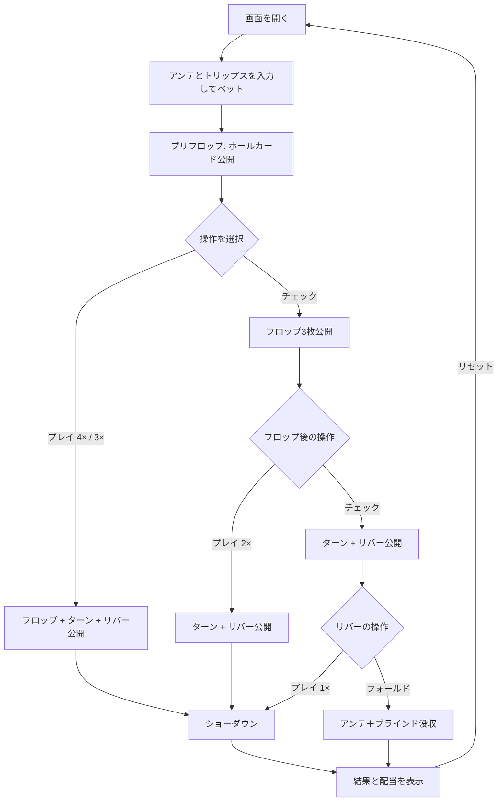

# アルティメット・テキサスホールデム（Web版）遊び方

## ゲーム概要

プレイヤー対ディーラーで行うテキサスホールデム派生のカジノゲームです。アンテとブラインドの 2 つの強制ベットに加え、プリフロップ / フロップ / リバーの 3 段階で「ベット倍率を決めるかチェックで先送りする」ことで勝負額を組み立てます。任意のサイドベット「トリップス」も置けます。

## 起動方法

```sh
go run ./cmd/trumpcards web  # CLI経由でWebサーバーを起動
go run ./cmd/server          # 直接Webサーバーを起動
```

ブラウザで `http://localhost:8080` にアクセスし、ナビゲーションバーから「アルティメット・テキサスホールデム」を選択します。
ナビバーの JA/EN ボタンで日本語・英語を切り替えられます。

## ルール

### 基本ルール

1. **ベット**: アンテを入力すると同額のブラインドが自動でベットされます。任意でトリップスのサイドベットも置けます。
2. **ホールカード**: プレイヤー・ディーラーに 2 枚ずつ配ります。
3. **プリフロップ**: 「プレイ 4×」または「プレイ 3×」でプレイベットを置くか、「チェック」で先送りします。
4. **フロップ（コミュニティ 3 枚）**: プリフロップでチェックした場合のみ。「プレイ 2×」または「チェック」を選びます。
5. **リバー（コミュニティ 5 枚）**: フロップでもチェックした場合のみ。「プレイ 1×」または「フォールド」を選びます。
6. **ショーダウン**: ベット完了またはフォールドで勝敗を判定し、各ベットの配当を計算します。

### 役・配当

- **ディーラークオリファイ**: ペア以上で成立。不成立時はアンテはプッシュ。
- **アンテ**: クオリファイ時、勝利で 1:1、引き分けでプッシュ、敗北で没収。
- **プレイベット**: 勝利で 1:1、引き分けでプッシュ、敗北で没収（クオリファイ有無に関わらず）。
- **ブラインド**: 勝利かつ役がストレート以上ならペイテーブルで支払い。ストレート未満で勝利・引き分けはプッシュ。敗北は没収。
  - Royal Flush 500:1 / Straight Flush 50:1 / Quads 10:1 / Full House 3:1 / Flush 3:2 / Straight 1:1
- **トリップス**（任意）: プレイヤーの 7 枚最良役で判定。Royal 50:1 / Straight Flush 40:1 / Quads 30:1 / Full House 8:1 / Flush 7:1 / Straight 4:1 / Three of a Kind 3:1。

### ゲーム終了

ショーダウンまたはフォールド後、「リセット」ボタンで新しいラウンドへ進みます。

## ゲームの流れ



## 画面の操作方法

### ベットフェーズ

- 「アンテ」と「トリップス（任意）」の数値を入力し、「ベット」ボタンで開始します。ブラインドはアンテと同額自動。

### プリフロップフェーズ

- 「プレイ 4×」「プレイ 3×」「チェック」のいずれかを選択します。

### フロップフェーズ

- 「プレイ 2×」または「チェック」を選択します。

### リバーフェーズ

- 「プレイ 1×」または「フォールド」を選択します。

### 結果フェーズ

- ディーラーのクオリファイ状況・勝敗・各ベットの配当が表示されます。「リセット」で次のラウンドへ。

### キーボードショートカット

| キー | アクション | 有効条件 |
|------|-----------|---------|
| `B` | ベット実行 | ベットフェーズ |
| `4` / `3` | プレイ 4× / 3× | プリフロップ |
| `C` | チェック | プリフロップ／フロップ |
| `2` | プレイ 2× | フロップ |
| `1` | プレイ 1× | リバー |
| `F` | フォールド | リバー |
| `R` | リセット | 結果フェーズ |

## 画面構成

```
┌────────────────────────────────────────────┐
│  ナビバー（ゲーム選択, JA/EN）              │
├────────────────────────────────────────────┤
│  PhaseIndicator (フェーズ表示)              │
├────────────────────────────────────────────┤
│  チップ: 800   トリップス支払い表           │
│                                            │
│  🃏 BOARD: ♠Q ♠J ♠T                         │
│  🔴 DEALER: ?? ??                           │
│  🟡 PLAYER: ♠A ♠K                           │
├────────────────────────────────────────────┤
│  GameFooter (操作ボタン)                    │
│  [プレイ 4×] [プレイ 3×] [チェック]         │
└────────────────────────────────────────────┘
```

## 遊び方のコツ

- ポケットペア / スーテッドエース / ハイブロードウェイは「プレイ 4×」で攻める。
- フロップでペア以上ができたら「プレイ 2×」で追撃。
- リバーは「自分の最良 5 枚がコミュニティ単体より強いか」を基準に「プレイ 1×」か「フォールド」を判断。
- ヒントトグルを ON にすると、現在の手札に合わせた推奨アクションが表示されます。
