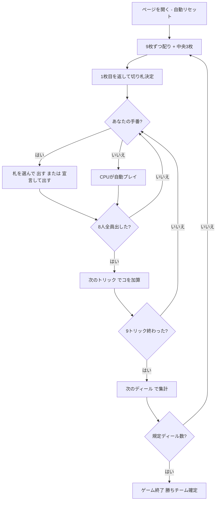

# うんすんカルタ（Web版）遊び方

## ゲーム概要

うんすんカルタは熊本県人吉市に伝わる、日本に現存する最古級のトリックテイキングです。**75枚（5スート×15枚）**のカルタを使い、**8人が4対4のチーム戦**で戦う「**八人メリ**」を遊べます。あなたは**席0（組0）**で、CPU 7 人と卓を囲みます。

一番の特徴は **数札の強弱がスートで逆になる**こと。長物（ぱお・いす）は 9 が最強、**丸物（こつ・おうる・くる）は 1 が最強**です。

## 起動方法

```sh
go run ./cmd/trumpcards web         # CLI経由でWebサーバーを起動
go run ./cmd/trumpcards web --open  # サーバー起動 + ブラウザを開く
go run ./cmd/server                 # 直接Webサーバーを起動
```

ブラウザで `http://localhost:8080` にアクセスし、ナビゲーションバーから「うんすんカルタ」を選択します。
ナビバーのJA/ENボタンで日本語・英語を切り替えられます。

## ルール

### デッキと札の強さ

| スート | 種類 | 数札の強さ |
|--------|------|-----------|
| ぱお（棍棒） | 長物 | 9 が最強 → 1 が最弱 |
| いす（刀剣） | 長物 | 9 が最強 → 1 が最弱 |
| こつ（聖杯） | 丸物 | **1 が最強 → 9 が最弱** |
| おうる（金貨） | 丸物 | **1 が最強 → 9 が最弱** |
| くる（巴紋） | 丸物 | **1 が最強 → 9 が最弱** |

絵札を含めた強さは **ウン > スン > ソウタ > ロバイ > キリ > ウマ > 数札** です。画面では**丸物の札を赤**で描くので、どちらの系統かがひと目で分かります。

### 席とチーム

8 人が敵味方交互に座ります。あなたは席 0（組 0）、CPU 2・4・6 が味方です。画面の各席には組の番号が出ます。

### 配りと切り札

3 枚ずつ 3 回配って 1 人 9 枚。残る 3 枚は中央に伏せ、**1 枚目を表に返したスートがそのディールの切り札**です。返した札はヘッダーに出ます。

### メリ / モンチ（宣言）

**フォロー義務は宣言で生まれます。** あなたがリードのときだけ「**宣言して出す**」ボタンが出ます。押すと、そのトリックは全員が台札のスートに従います。宣言が無ければ誰でも好きな札を出せます。

### トリックと勝敗

8 枚出揃った時点で、切り札が出ていればその最強、無ければ台札スートの最強を出した席のチームが「**コ**」を 1 つ取ります。9 トリックで 9 コ。規定ディール（既定 4、最大 8）を終えて累計の多いチームの勝ちです。

## ゲームの流れ



## 画面の操作方法

- **出す**: 手札から札を選び「出す」を押します。宣言のあるトリックでは、**出せる札だけがハイライト**されます。
- **宣言して出す**: あなたがリードのときだけ出るボタンです。押すと、そのトリックは全員がフォロー義務を負います。
- **次のトリック / 次のディール**: トリックが決まったら「次のトリック」、9 トリック終わったら「次のディール」で集計して次へ進みます。
- **設定**: CPU難易度、マッチのディール数（1〜8）、ヒントの ON/OFF を切り替えられます。

## 画面構成

- **ヘッダー**: ゲーム名・フェーズ表示・**切り札（返した札）**・CLI 切り替え
- **情報サイドバー**: 各席の組・親バッジ・取った「コ」・チーム別の合計と累計
- **中央**: 現在のトリック（8 枚まで並びます）
- **フッター**: あなたの手札（出せる札がハイライト）・アクションボタン

## 遊び方のコツ

- **丸物の 1 は強い。** こつ・おうる・くるの 1 は、その系統の最強の数札です。赤い札の 1 を安売りしないでください。
- **宣言は押し切れるときだけ。** フォロー義務は自分にも掛かります。強い台札を持っているときの武器です。
- **味方が取っているなら安く落とす。** 隣は必ず敵、2 つ隣が味方です。すでに味方が最強札を出しているトリックに強い札を重ねるのは損です。
- **絵札は 1 スートに 6 枚。** どの数札より強いので、数札で取りにいく前に絵札の残りを数えましょう。
