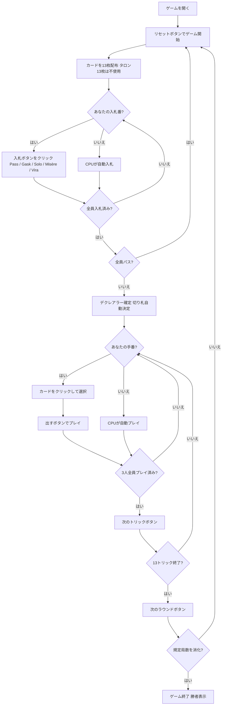

# ヴィーラ（Web版）遊び方

## ゲーム概要

Vira（ヴィーラ）は19世紀スウェーデンで生まれたオークション・トリックテイキングゲームです。52枚デッキを3人でプレイします。各ラウンドの最初に**入札フェーズ**があり、最高入札者が**デクレアラー**（宣言者）として1人で2人の**ディフェンダー**と対戦します。精算は**ポット式**です。各局の開始時に全員が**アンティ1点**をポットへ入れ、デクレアラーが達成すれば**ポットを総取り**したうえで各ディフェンダーからコントラクト価値を受け取ります。失敗すればコントラクト価値をポットへ積み増し、各ディフェンダーにも同額を支払います。**ポットは次局へ持ち越される**ので、失敗が続くほど次のデクレアラーの見返りが大きくなります。全員パスの流局でもポットは戻らず持ち越されます。規定局数（デフォルト**6局**）を終えた時点で持ち点が最大のプレイヤーが勝者です。同点なら勝者なしとなります。あなたは席0としてプレイします。

## 起動方法

```sh
go run ./cmd/trumpcards web         # CLI経由でWebサーバーを起動
go run ./cmd/trumpcards web --open  # サーバー起動 + ブラウザを開く
go run ./cmd/server                 # 直接Webサーバーを起動
```

ブラウザで `http://localhost:8080` にアクセスし、ナビゲーションバーから「ヴィーラ」を選択します。
ナビバーのJA/ENボタンで日本語・英語を切り替えられます。

## ルール

### デッキと配布

- **デッキ**: 52枚（A,2〜10,J,Q,K × 4スート）
- **プレイヤー**: 3人（あなた = 席0、CPU1〜2）
- **配布**: 各プレイヤー13枚、計13トリック（残り13枚のタロンは未使用）
- **カードの強さ（高い順）**: A > K > Q > J > 10 > 9 > 8 > 7

### 入札フェーズ

ディーラーの左隣から時計回りに、各プレイヤーが1回だけ入札します。

| コントラクト | 目標トリック | 価値 | 内容 |
|--------------|------------|------|------|
| **Pass（パス）** | — | — | 入札をパスする |
| **Gask（ガスク）** | 7 | 2 | 単独で7トリック以上取ることを宣言 |
| **Solo（ソロ）** | 8 | 4 | 単独で8トリック以上取ることを宣言 |
| **Misère（ミゼール）** | 0 | 6 | 単独で0トリックを取ることを宣言（切り札なし） |
| **Vira（ヴィーラ）** | 10 | 8 | 単独で10トリック以上取ることを宣言。ゲーム名を冠する最上位 |

- 先の入札より高いコントラクトのみ上書きできます（Pass < Gask < Solo < Misère < Vira）。同値も通りません。
- **Misère はソロとヴィーラの間**です。0トリックを狙う特殊契約ですが「降りる手」ではなく、価値6の実契約として梯子の上位に置かれています。
- 全員がパスした場合はそのラウンドに宣言者は立たず、**ポットはそのまま次局へ持ち越されます**。
- 最高入札者が**デクレアラー**となり、他の2人が**ディフェンダー**として対戦します。
- 史実のヴィーラは30を超える契約を持ちますが、本実装はこの5段に絞っています。タロン交換も省略し、配られた13枚のみでプレイします。

### 切り札

- **Gask / Solo / Vira**: デクレアラーの手札で最も枚数の多いスートが自動的に切り札スートになります（簡易実装）。
- **Misère**: 切り札はありません。

### トリック・テイキング

- **スートフォロー義務**: リードされたスートのカードを持っている場合は必ず出さなければなりません。
- 持っていない場合は任意のカードを出せます（切り札でも他スートでも可）。
- **トリックの勝者**:
  - 切り札スートのカードが場にあれば、最も強い切り札カードが勝ちます。
  - 切り札がなければ、リードスートの最も強いカードが勝ちます。
- トリックの勝者が次のトリックをリードします。

### 勝利条件

精算は**ポット式**です。各局の開始時に全員が**アンティ1点**をポットへ入れます。

| 結果 | 精算 |
|------|------|
| デクレアラーが契約達成 | **ポットを総取り**し、さらに**各**ディフェンダーからコントラクト価値（Gask=2, Solo=4, Misère=6, Vira=8）を受け取る |
| デクレアラーが契約失敗 | コントラクト価値をポットへ積み増し、**各**ディフェンダーにも同額を支払う |
| 全員パス（宣言者なし） | 持ち点は動かず、ポットはそのまま持ち越される |

**Misère だけ達成条件が逆**です。他の契約は目標トリック数**以上**で達成ですが、Misère は**1トリックも取らなかったとき**にのみ達成となります。

**ポットは次局へ持ち越されます**。失敗が続くほど積み上がるので、次に達成した宣言者の見返りが大きくなります。

**マッチ勝利**: 規定局数（デフォルト **6局**、各プレイヤーがディーラーを一巡するため**プレイヤー数の倍数**）を終えた時点で持ち点が最大のプレイヤーが勝者です。**同点なら勝者なし**となります。

## ゲームの流れ



## 画面の操作方法

### BIDフェーズ（入札フェーズ）

あなたの入札番になると、手札の下に入札ボタンが表示されます。

- **「Pass」ボタン**: 入札をパスします。いつでも押せます。
- **「Gask」ボタン**: Gask（7トリック以上）を宣言します。先行入札がGask以上の場合はグレーアウトして選択できません。
- **「Solo」ボタン**: Solo（8トリック以上）を宣言します。先行入札がSolo以上の場合は選択できません。
- **「Misère」ボタン**: Misère（0トリック・切り札なし）を宣言します。**Misèreは梯子の上から2番目**なので、SoloよりMisèreの方が強い宣言です。先行入札がMisère以上の場合は選択できません。
- **「Vira」ボタン**: Vira（10トリック以上）を宣言します。最上位なので、先行入札がViraのときのみ選択できません。

### PLAYフェーズ（トリックフェーズ）

- あなたの手番のとき、手札のカードをクリックして選択します。
- **「出す」ボタン**: 選択したカードをプレイします。スートフォロー義務に従う必要があります（義務に反するカードは選択できません）。
- **「次のトリック」ボタン**: トリックが解決したら次へ進みます。
- **「次のラウンド」ボタン**: 13トリック終了後にスコアを集計して次のラウンドへ進みます。

### キーボードショートカット

| キー | アクション | 有効条件 |
|------|-----------|---------|

## 画面構成

```
┌─────────────────────────────────────────────────────┐
│  Vira (ヴィーラ) [JA/EN] [CLI]           │
├─────────────────────────────────────────────────────┤
│  ラウンド: 1  トリック: 0  フェーズ: BID             │
│  切り札: -  デクレアラー: -  コントラクト: -         │
│  ゲーム点: あなた=0  CPU1=0  CPU2=0                  │
├──────────┬──────────────────────────────────────────┤
│  CPU1    │                                           │
│  (役割)  │     現在のトリック表示エリア               │
│  CPU2    │     （各プレイヤーの出したカード）          │
│  (役割)  │                                           │
├──────────┼──────────────────────────────────────────┤
│  入札状況│  メッセージ / 結果表示                    │
│  CPU1=?  │  ラウンド結果・スコア情報                  │
│  CPU2=?  │                                           │
├──────────┴──────────────────────────────────────────┤
│  あなたの手札（クリックで選択）                       │
│  [A♥][K♥][Q♠][J♦][10♣][9♠][8♥][7♦][K♣][Q♦][…] 13枚 │
│  [Pass] [Gask] [Solo] [Misère] [Vira]   ← BIDフェーズ│
│  [出す] [次のトリック] [次のラウンド]   ← PLAYフェーズ│
└─────────────────────────────────────────────────────┘
```

- **ヘッダー**: ゲーム名・フェーズ表示・言語切り替えトグル・CLI切り替えトグル。
- **ラウンド／トリック表示**: 現在のラウンド番号・トリック番号・フェーズ・切り札スート・デクレアラーとコントラクト表示。
- **ゲーム点**: 各プレイヤーの累積ゲーム点をリアルタイムで表示。
- **プレイヤー表示エリア（左）**: CPU各プレイヤーの手札枚数・役割（デクレアラー or ディフェンダー）を表示。
- **入札状況（左）**: 各プレイヤーの入札内容（入札フェーズ中）。
- **トリック表示エリア（中央）**: 場に出ているカードと出したプレイヤー名。
- **メッセージボックス**: フェーズ・ラウンド結果（トリック数・ゲーム点）・勝敗の案内。
- **フッター（手札エリア）**: あなたの手札と操作ボタン（BIDフェーズは入札ボタン5種、PLAYフェーズは出す／次のトリック／次のラウンド）。

## 遊び方のコツ

- **入札の判断**: Gask（7トリック以上）は手札のA・K・Qが十分にあれば検討できます。Solo・Vira は強いカードが手厚い場合のみ宣言しましょう。Misère（価値6）はリスクが高い代わりにリターンも大きく、手札が弱いカードで揃っているときが狙い目です。
- **ポットを見て入札する**: 失敗が続いた後のポットは大きく膨らんでいます。同じ手札でも、ポットが厚い局は宣言する価値が上がります。**ポットは達成した宣言者の総取り**なので、画面のポット表示は入札判断の一部です。
- **デクレアラーは切り札を引き出せ**: Gask / Solo / Vira では、デクレアラーの最長スートが切り札になります。序盤に切り札リードを繰り返してディフェンダーの切り札を消費させると、後半で安全にトリックを取れます。
- **ディフェンダーは2人で連携して阻止**: デクレアラーが強いスートでリードしてきたら、片方が低いカードを捨ててもう片方の高いカードが勝てるようにサポートしましょう。失敗させればポットが積み増され、次に自分が宣言するときの取り分が増えます。
- **Misèreはボイドを活用**: Misèreのデクレアラーは切り札なしで0トリックを目指します。手札の強いカードを早めに捨てられるよう、ボイド（そのスートを持たない）状態を意図的に作ることが重要です。ディフェンダーはデクレアラーが強いカードを捨てられないよう、そのスートをリードし続けましょう。**1トリック取らせれば即失敗**です。
- **コントラクト価値を意識**: Vira（10トリック以上）の失敗は各ディフェンダーに8点ずつ払い、さらに8点をポットへ積みます。確実でなければ Solo に留めましょう。
- **グレーアウトボタンを確認**: 入札フェーズで既に高いコントラクトが出ている場合、それ以下のボタンはグレーアウトされます。残りの選択肢を確認してから入札しましょう。
- **52枚デッキで13枚ずつ**: 残り13枚のタロンは使わないので、場に出ない札が13枚あります。相手が持っていないと決めつけられず、フォロー切れが判明するまでスートの分布は読み切れません。
- **同点は勝者なし**: 規定局数を終えて持ち点が並ぶと、誰も勝ちません。最終局で首位と並ぶだけの手を選ぶより、抜き去る手を選ぶ必要があります。
