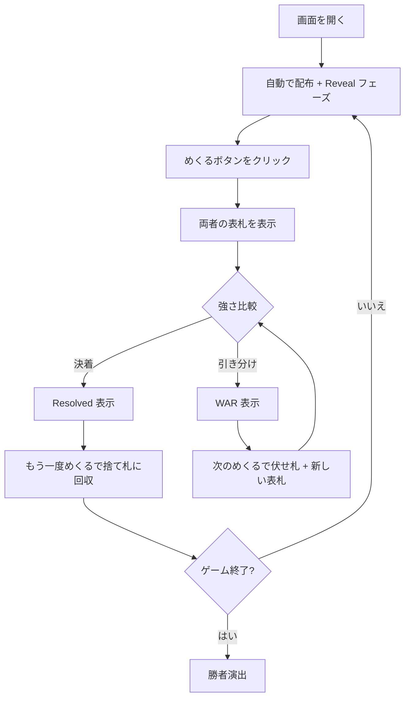

# 戦争（Web版）遊び方

## ゲーム概要

プレイヤー1人対CPU 1人で遊ぶ、世界的に知名度の高い純粋運ゲーム。52枚のデッキを半分ずつに分け、お互い山札の一番上をめくって強いカードを出した方がそのラウンドに勝ち、場札を自分の捨て札に加えます。引き分けが起きると「戦争」が発動し、追加の伏せ札と新しい表札で勝敗を決めます。

## 起動方法

```sh
go run ./cmd/trumpcards web     # CLI経由でWebサーバーを起動
go run ./cmd/server             # 直接Webサーバーを起動
```

ブラウザで `http://localhost:8080` にアクセスし、ナビゲーションバーから「戦争」を選択します。ナビバーのJA/ENボタンで日本語・英語を切り替えられます。

## ルール

### 基本ルール

- 52枚のトランプ（ジョーカーなし）を使用
- シャッフル後、26枚ずつプレイヤーとCPUに配布
- めくるボタンで各ラウンドを進行
- 両者が山札から1枚ずつめくり、強さを比較（A高、スート無視）
- 勝った方が場札を自分の捨て札に回収
- 山札が空になると捨て札をシャッフルして山札に戻す

### 戦争（タイ）

- 表札の強さが等しいとき戦争発生
- もう一度「めくる」で両者が最大3枚を伏せ札として場に積み、新しい1枚を表札として出す
- 表札の強い方が場にあるカードを全て獲得
- 再び引き分けなら戦争を重ねる

### ゲーム終了

- どちらかが全52枚を保有したら勝利
- 相手が総枚数0になった場合も勝利
- 「最大ラウンド数」設定（既定500）に達した場合、総枚数の多い側を勝者とする

## ゲームの流れ



## 画面の操作方法

### プレイフェーズ

1. **「めくる」ボタン**: 両者が山札から1枚ずつ表にする
2. 強さを比較 → 勝者が場札を回収、または引き分けで戦争（WAR）発生
3. 戦争中は再度「めくる」で伏せ札を積み、新しい表札で勝敗を決める
4. **「自動進行」ボタン**: 決着がつくまでラウンドを自動で進める
5. **「リセット」ボタン**: 現在の設定で新しいゲームを開始
6. **設定パネル**: 最大ラウンド数（10〜10000）を変更可能

## 画面構成

```
┌────────────────────────────────────────────┐
│  CPU 山札/捨札 (残り枚数)                     │
│                                            │
│  場札エリア: [CPU表札] vs [プレイヤー表札]    │
│              積み枚数表示                    │
│                                            │
│  あなた 山札/捨札 (残り枚数)                  │
│                                            │
│  [めくる] [自動進行] [リセット]  設定: 最大ラウンド数 │
└────────────────────────────────────────────┘
```

- **CPU 山札/捨札**: 画面上部、CPUの残りカード枚数
- **場札エリア**: 中央、お互いの表札と場の積みカード枚数
- **あなた 山札/捨札**: 画面下部、自分の残りカード枚数
- **操作ボタン**: めくる、自動進行、リセット
- **設定パネル**: 最大ラウンド数（10〜10000）

## 遊び方のコツ

- 完全な運ゲームなので戦略はありません。テンポよく「めくる」を連打するのが楽しみ方です
- 戦争の連鎖で一気に大量のカードを獲得できると逆転が起きやすい
- 長引く場合は「最大ラウンド数」を下げて短期決戦にすることもできます
- 「めくる」を1枚ずつ押すのが面倒な場合は「自動進行」で決着まで一気に進められます
