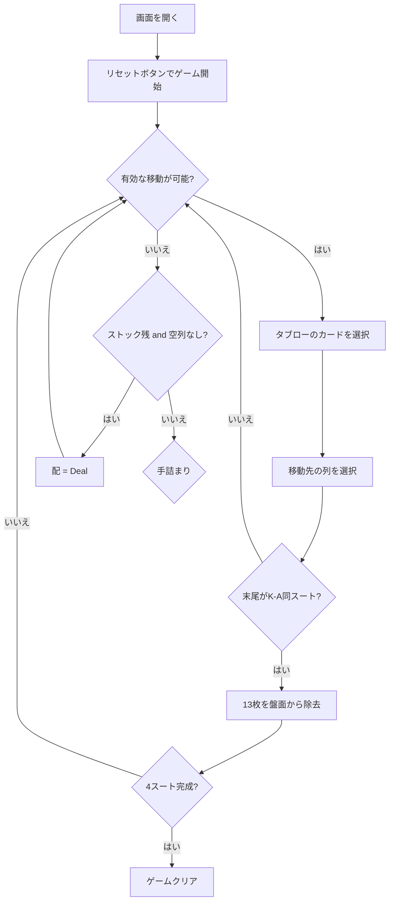

# ワスプ（Web版）遊び方

## ゲーム概要

ワスプ（Wasp）は1人用のソリティアカードゲームで、スコーピオン（Scorpion）の易しいバリアントです。ユーコンの「順序に関係なく表向きのカードをまとめて移動できる」仕組みと、スパイダーの「同スートでK→Aが揃うと盤面から除去される」仕組みを組み合わせています。スコーピオンとの唯一の違いは、**空の列に任意のカードを置ける**点で、手詰まりになりにくく初心者にもおすすめです。7列の場札とストック3枚を駆使して、4つのスートすべてをK→Aの順に揃えればクリアです。

## 起動方法

```sh
go run ./cmd/trumpcards web   # CLI経由でWebサーバーを起動
go run ./cmd/server           # 直接Webサーバーを起動
```

ブラウザで `http://localhost:8080` にアクセスし、ナビゲーションバーから「ワスプ」を選択します。
ナビバーのJA/ENボタンで日本語・英語を切り替えられます。

## ルール

### 配り方

- 49枚を7列のタブローに配ります（各列7枚）
- 列0〜3: 先頭3枚が裏向き、残り4枚が表向き
- 列4〜6: 全7枚が表向き
- 残り3枚はストックとして保持

### 移動ルール

- **タブロー → タブロー**: 表向きのカード（および上に乗っているすべてのカード）をまとめて移動できます。移動先の最上段カードと **同じスートで降順** の関係が必要です。**空の列には任意のカードを置けます**（スコーピオンはKのみ。ここがワスプとの唯一の違いです）
- **ストックからの配布（Deal）**: ストックにカードが残っていて、かつ空の列が1つもない場合のみ、列0〜2の末尾に1枚ずつ表向きで配ります

### 完成とクリア

- 列の末尾13枚が **同スートのK→A** で揃うと、その13枚が自動的に盤面から除去されます
- 4つのスートすべてが除去されるとクリア
- **ギブアップ**: いつでもギブアップ可能
- **手詰まり**: 有効な手がない場合、手詰まりと判定されます（空列に任意のカードを置けるため、スコーピオンより手詰まりは起きにくくなっています）

## ゲームの流れ



## 画面の操作方法

### カードの移動

1. 移動したい表向きのカードをクリック（選択状態になる）
2. 移動先の列をクリック
3. ドラッグ&ドロップでも移動可能

### ストックからの配布

- 空列がない状態で「配」ボタンを押すと、ストック3枚が列0〜2の末尾に1枚ずつ配られます

### キーボードショートカット

| キー | アクション | 有効条件 |
|------|-----------|---------|
| H | ヒント | プレイ中 |
| A | オートコンプリート | プレイ中 |
| G | ギブアップ | プレイ中 |
| Z | 元に戻す | アンドゥ可能時 |
| D | 配（Deal） | プレイ中 |

## 画面構成

```
┌────────────────────────────────────────────┐
│  手数: N  Stock: 3  Completed: 0/4         │
├────────────────────────────────────────────┤
│  列0  列1  列2  列3  列4  列5  列6        │
│  [??] [??] [??] [??] [A♥] [K♣] [7♠]       │
│  [??] [??] [??] [??] [5♦] [Q♣] [2♠]       │
│  [??] [??] [??] [??] [10♣][J♣] [9♦]       │
│  [Q♥] [3♠] [K♦] [4♥] ...   ...   ...       │
│  [J♥] [2♦] [Q♦] ...                        │
│  [10♥][A♠] ...                             │
│  [9♥] ...                                   │
├────────────────────────────────────────────┤
│  [リセット] [配] [ヒント] [自動完成]       │
│  [元に戻す] [ギブアップ]                   │
└────────────────────────────────────────────┘
```

## 遊び方のコツ

- 同スートのK→Aを1列にまとめることを常に意識しましょう
- まず列0〜3の裏向きカードを早く解放することを優先
- 空列には任意のカードを置けるので、大きな「仮置き場」として積極的に活用しましょう
- ストックは最終手段として温存し、盤面で手が出なくなってから配るのがおすすめです
- 手詰まりになったら「元に戻す」で戻ってやり直しましょう
