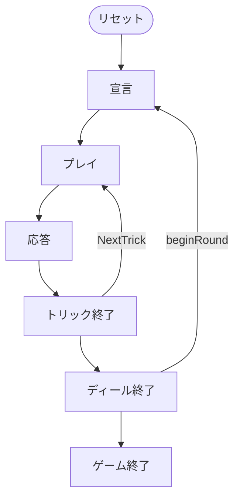

# ヴァッテン（Web版）遊び方

## ゲーム概要

Watten（ヴァッテン）はバイエルン／オーストリアで親しまれる4人2チームのトリックテイキングゲームです。32枚デッキ（7〜A × 4スート）を使い、ディーラーが「Schlag（シュラーク）ランク」と「切り札スート（critical）」を宣言します。永久最強札 Max（K♥）＞ Belli（K♦）＞ Spitz（7♦）に続き、Schlag ランクの4枚、切り札スート、平札の順で強さが決まります。各ディールは5トリックで、ステークをレイズし相手が hold／fold で応答する駆け引きが魅力。3トリック以上取ったチームがステークを得点し、先に15点（変更可）に達したチームが勝利します。Web版では3つのCPUと自動的に組み合わせられ、ボタン操作で宣言・プレイ・レイズ・応答ができます。

## 起動方法

```sh
go run ./cmd/trumpcards web  # CLI経由でWebサーバーを起動
go run ./cmd/server          # 直接Webサーバーを起動
```

ブラウザで `http://localhost:8080` にアクセスし、ナビゲーションバーから「ヴァッテン」を選択します。
ナビバーのJA/ENボタンで日本語・英語を切り替えられます。

## ルール

### 基本ルール

- プレイヤーは4人（人間1 + CPU3）。プレイヤー0と2、プレイヤー1と3が同チーム。人間はシート0（チーム0）。
- 32枚デッキ（7,8,9,10,J,Q,K,A × 4スート）を使用。各プレイヤーに5枚配る。各ディールは5トリック。

### 宣言（Declare）

ディーラーが Schlag ランク（A または 7〜K）と切り札スートを選んで宣言します。

### 札の強さ

- Max（K♥） ＞ Belli（K♦） ＞ Spitz（7♦）— 永久の3大トランプ
- 続いて Schlag ランクの4枚 ＞ 切り札スートの札 ＞ 平札。
- 平札はリードスートに従います。

### ステーク（レイズ／応答）

- リードのプレイヤーはトリック開始前にステークをレイズできます。
- レイズされた相手チームは「hold（受ける）」か「fold（降りる）」を選びます。

### 勝敗

- 5トリック中3トリック以上を取ったチームがそのディールのステークを得点。
- 先に15点（変更可）に達したチームが勝利します。

## ゲームの流れ

ゲームの進行は `internal/domain/Watten.go` のフェーズ機械そのものです。各ノードは同ファイルの `WattenPhase` 定数、矢印ラベルはその遷移を行うメソッド名です。



## 画面の操作方法

- 宣言フェーズ（自分がディーラーのとき）: Schlag ランクボタンと切り札スートボタンを選び、「宣言」ボタンで確定します。
- 自分の手番では、手札のカードをクリックして選び、「出す」ボタンでプレイします。リード時は「レイズ」ボタンでステークを引き上げられます。
- レイズされたときは「hold」または「fold」ボタンで応答します。
- ディール終了後は「次のディール」ボタンで進めます。
- 「ヒント」ボタンで推奨手を確認できます。

## 画面構成

上から順に、ページのコンポーネント構成そのままの並びです。

```
┌──────────────────────────────────────────────────┐
│  ヴァッテン                                         │
│  ラウンド: 1  トリック: 0  Schlag: 7  切り札: ♦  ステーク: 2
├──────────────────────────────────────────────────┤
│  設定パネル（CPU難易度・目標点など）             │
├──────────────────────────────────────────────────┤
│  場（現在のトリック）                            │
│    CPU1 [♠A]   CPU2 [♠9]   CPU3 [♠8]             │
│  直前のトリック（勝者つき）                      │
├──────────────────────────────────────────────────┤
│  メッセージ / ヒント                             │
├──────────────────────────────────────────────────┤
│  棋譜（アクションログ）                          │
├──────────────────────────────────────────────────┤
│  あなたの手札                                    │
│  [♠K][♠Q][♣Q][♣10][♥J][♥10][♥9][♥7][♦J]        │
│  [宣言] [カードを出す] [レイズ] [ホールド] [フォールド] [次へ]
│  [リセット]                                      │
└──────────────────────────────────────────────────┘
```

- **ヘッダー**: ラウンド数・トリック数・ディーラーが宣言した Schlag ランクと切り札スート・現在のステーク
- **カードの強さ**: Max(♥K) > Belli(♦K) > Spitz(♦7) > Schlag ランクの4枚 > 切り札 > その他
- **ステーク**: `レイズ` で引き上げると、相手チームは `ホールド`（受ける）か `フォールド`（降りる）を選びます
- **設定パネル**: CPU 難易度と目標点（既定 15）- **メッセージ / ヒント**: 直前の操作の結果と、ヒントボタンを押したときの推奨手
- **棋譜（アクションログ）**: これまでの手の履歴。折りたたみ式
- **あなたの手札**: 出せるカードだけが押せます。出せない札は淡く表示されます
- **リセット**: 新しいゲームを開始します
- **CLIモード切替**: 画面右上のトグルで、CUI 版と同じテキスト表示に切り替えられます（`CliToggle` / `CliTerminal`）
