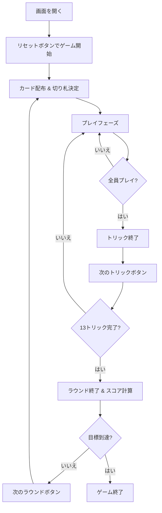

# ホイスト（Web版）遊び方

## ゲーム概要

4人プレイの2vs2パートナー戦トリックテイキングゲームです。ビッドフェーズがなく、純粋なカードプレイのみで構成された古典的なゲームです。先に目標ポイントに到達したチームが勝利します。

## 起動方法

```sh
go run ./cmd/trumpcards web   # CLI経由でWebサーバーを起動
go run ./cmd/server           # 直接Webサーバーを起動
```

ブラウザで `http://localhost:8080` にアクセスし、ナビゲーションバーから「ホイスト」を選択します。
ナビバーのJA/ENボタンで日本語・英語を切り替えられます。

## ルール

### 基本ルール

- 52枚のカードを4人に13枚ずつ配ります
- ディーラーの最後のカードのスートがそのラウンドの切り札（トランプ）になります
- フォロースート必須（リードされたスートのカードを持っていればそれを出す）
- 切り札は常にリードスートに勝ちます

### チーム

- 席0と席2がチーム0（あなたはチーム0）
- 席1と席3がチーム1

### 得点

- 各チームが獲得したトリック数を合計します
- 6トリックを超えた分がそのラウンドのポイントになります（例: 8トリック獲得 → 2ポイント）
- 先に目標ポイント（デフォルト5）に到達したチームが勝利

### CPU難易度

| レベル | 説明 |
|--------|------|
| Easy | ランダムにカードを選択 |
| Normal | 基本的な戦略に基づくプレイ |
| Hard | パートナーシップを考慮した高度な戦略 |

## ゲームの流れ



## 画面の操作方法

### プレイフェーズ

1. 手札からカードをクリックして選択
2. 「出す」ボタンをクリック
3. CPUが自動的にカードを出します

### トリック終了

- 「次のトリック」ボタンで次のトリックへ進みます

### ラウンド終了

- 「次のラウンド」ボタンでスコア計算後、次のラウンドへ進みます

## 画面構成

```
┌────────────────────────────────────────────┐
│  ナビゲーションバー                          │
├────────────────────────────────────────────┤
│  切り札表示 / チームスコア / ラウンド情報      │
├──────────────────┬─────────────────────────┤
│  CPUプレイヤー    │  現在のトリック           │
│  (3人分)         │                         │
├──────────────────┴─────────────────────────┤
│  あなたの手札                               │
│  [操作ボタン]                               │
└────────────────────────────────────────────┘
```

## 遊び方のコツ

- パートナーが勝っているトリックでは低いカードを出しましょう
- 切り札は温存して、重要な場面で使いましょう
- リードポジションでは高いカードで確実にトリックを取りましょう
