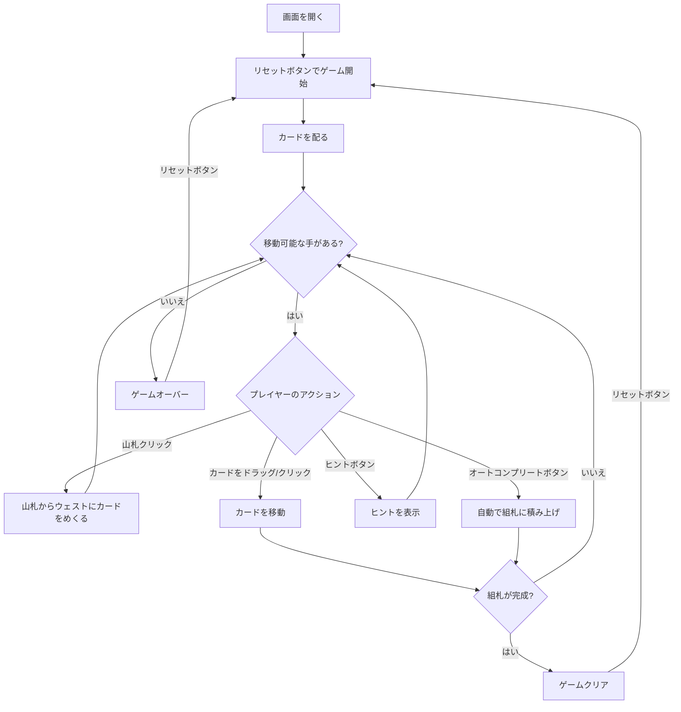

# ホワイトヘッド（Web版）遊び方

## ゲーム概要

1人用のソリティアカードゲームです。52枚のカードを使い、7列のタブロー、山札、ウェスト、4つの組札で構成されます。組札にA→Kまでスート別に積み上げればクリアです。

## 起動方法

```sh
go run ./cmd/trumpcards web  # CLI経由でWebサーバーを起動
go run ./cmd/server          # 直接Webサーバーを起動
```

ブラウザで `http://localhost:8080` にアクセスし、ナビゲーションバーから「ホワイトヘッド」を選択します。
ナビバーのJA/ENボタンで日本語・英語を切り替えられます。

## ルール

### 基本ルール

- 52枚のトランプ（ジョーカーなし）を使用
- 7列のタブローに左から1枚、2枚、...、7枚ずつカードを配る（**28枚すべてが表向き**）
- 残りの24枚は山札（ストック）に裏向きで置く
- 4つの組札（ファンデーション）はスート別にA→Kの順に積み上げる
- タブローでは降順かつ**同じ色**で重ねる（例: ♠K の上に ♣Q）。Klondike の交互色とは逆

### ゲームクリア

- 4つの組札すべてにA→Kまで13枚ずつ積み上げるとゲームクリア

### ゲームオーバー

- これ以上移動可能な手がない場合はゲームオーバー

### 手詰まり検出

- ヒントが存在せず、かつ山札とウェストが空の場合、または山札を一巡しても進展がなかった場合に「手詰まりです」とメッセージが表示されます
- 手詰まり状態では「元に戻す」またはギブアップを選択できます

## ゲームの流れ



## 画面の操作方法

### カードを移動する

1. 移動元のカードをクリックして選択します
2. 移動先のカード（またはエリア）をクリックして移動を確定します
3. タブロー内では表向きの連続したカード列をまとめて移動できます

### 山札をめくる

1. 山札エリアをクリックしてカードをウェストにめくります（1枚引きモードでは1枚、3枚引きモードでは3枚）
2. 3枚引きモードでは、めくったカードのうち一番上のカードのみ操作可能です
3. 山札が空になった場合、再度クリックするとウェストのカードが山札に戻ります

### ドローモード切替

フッターの「ドローモード」セレクトで1枚引き / 3枚引きを切り替えられます。切替時にゲームがリセットされます。

### アンドゥ（元に戻す）

**「元に戻す」** ボタンまたは `z` キーで直前の操作を取り消せます。何度でも元に戻せます。

### スコアモード

フッターの「スコアモード」セレクトで「なし」/「ベガス」を切り替えられます。
- **ベガス**: スコア = -52 + 5 × 組札のカード枚数。クリア時にはタイムボーナスも加算されます。

### ヒント・オートコンプリート

1. **「ヒント」** ボタンをクリックすると、次に可能な手を提案します
2. **「オートコンプリート」** ボタンをクリックすると、組札に安全に移動できるカードを自動で移動します

### キーボードショートカット

ゲーム中、以下のキーボードショートカットが使用できます。

| キー | アクション | 有効条件 |
|------|-----------|---------|
| `d` | カードをめくる（ドロー） | プレイ中 |
| `z` | 元に戻す（アンドゥ） | プレイ中 |
| `h` | ヒント | プレイ中 |
| `a` | オートコンプリート | プレイ中 |
| `g` | ギブアップ | プレイ中 |

※ テキスト入力欄にフォーカスがある場合、ショートカットは無効になります。

## 画面構成

```
┌────────────────────────────────────────────┐
│              ゲーム情報                     │
│  手数: 15  スコア: -27  タイム: 02:15       │
├────────────────────────────────────────────┤
│  山札・ウェストエリア    組札エリア         │
│  [山札] [♠K]          [♠A][♥A2][  ][  ]  │
├────────────────────────────────────────────┤
│              タブロー                      │
│  [1]    [2]    [3]    [4]    [5]   [6]  [7]│
│  ♥Q    ??     ??     ??     ??    ??    ?? │
│         ♣J    ??     ??     ??    ??    ?? │
│                ♦10   ??     ??    ??    ?? │
│                       ♠9    ??    ??    ?? │
│                              ♥8   ??    ?? │
│                                   ♣7    ?? │
│                                         ♦6 │
├────────────────────────────────────────────┤
│  [引く] [元に戻す] [ヒント] [オートコンプリート]│
│  [ギブアップ] [ドローモード▼] [スコアモード▼]│
│  [リセット]                                │
└────────────────────────────────────────────┘
```

- **山札エリア**: クリックでカードをめくる（残りカード数表示）
- **ウェストエリア**: めくられたカードが表示される
- **組札エリア**: 4つのスート別の組札（A→Kの順に積み上げ）
- **タブロー**: 7列のカード列
  - タブローに伏せ札はありません（全て表向き）
  - 表向きカード: クリックで選択・移動
- **ボタン**:
  - 「引く」: 山札からカードをめくる
  - 「元に戻す」: 直前の操作を取り消す
  - 「ヒント」: 次の一手を提案
  - 「オートコンプリート」: 自動で組札へ移動
  - 「ギブアップ」: 現在のゲームを終了
  - 「ドローモード」: 1枚引き / 3枚引きの切替
  - 「スコアモード」: なし / ベガスの切替
  - 「リセット」: 新しいゲームを開始

## 遊び方のコツ

- **伏せ札はありません。**28枚すべてが最初から見えているので、詰みは配りで決まります
- Aが出たらすぐに組札へ移動しましょう
- 空いた列には**どの札でも**置けます（Klondike は K のみ）
- 山札を何度もめくり直して使えるカードを探しましょう
- ヒントボタンで詰まった時のアドバイスを得られます
- オートコンプリートは組札に安全に移動できるカードがある場合に便利です
