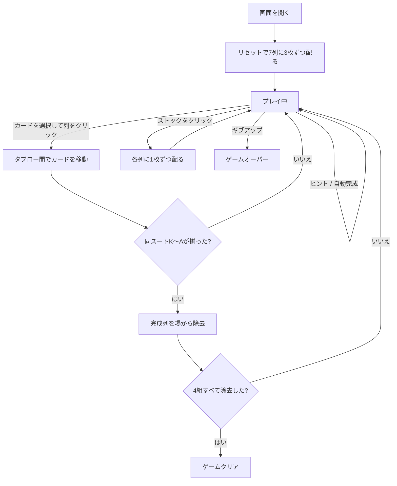

# ウィル・オ・ザ・ウィスプ（Web版）遊び方

## ゲーム概要

1人用のソリティアゲームです。1デッキ52枚を使い、7列に3枚ずつ、合計21枚をすべて表向きで配ります。残り31枚はストックです。KからAまで同じスートの列を4組すべて除去すれば勝利です。

## 起動方法

```sh
go run ./cmd/trumpcards web
go run ./cmd/server
```

ブラウザで `http://localhost:8080` にアクセスし、ナビゲーションバーから「ウィル・オ・ザ・ウィスプ」を選択してください。JA/ENボタンで言語を切り替えられます。

## ルール

- 7列に3枚ずつ、21枚をすべて表向きで配る（伏せ札はありません）。
- ストックは31枚。全列に1枚ずつ配る操作を4回行い、最後は残り3枚を左の3列へ配る。
- 空列があるときはストックから配れません。
- タブローはスートを問わずランク降順に積める。
- 同スートの連続降順列はまとめて移動できる。
- 空列には任意の札または連続列を置ける。
- 同スートのKからAが揃うと自動的に除去され、4組すべて除去するとゲームクリア。

### 得点

- 開始時: 500点
- 移動/配り: -1点
- スート完成: +100点

## ゲームの流れ



## 画面の操作方法

1. 移動元のカードをクリック/タップして選択します。
2. 移動先の列をクリック/タップして移動します。
3. ストックをクリック/タップすると、各列に1枚ずつ配られます。
4. ドラッグ&ドロップでも移動できます。

| キー | アクション |
|------|------------|
| `d` | ストックから配る |
| `h` | ヒントを表示 |
| `a` | 自動完成 |
| `g` | ギブアップ |
| `z` | 元に戻す |

## 画面構成

```
┌────────────────────────────────────────────┐
│  フェーズ表示  手数  スコア  完成スート数      │
│                                            │
│  ストック (残り枚数)                         │
│                                            │
│  タブロー 列0 列1 列2 列3 列4 列5 列6           │
│                                            │
│  [配る] [元に戻す] [ヒント] [自動完成] [ギブアップ] │
│  [リセット]                                 │
└────────────────────────────────────────────┘
```

- **ヘッダー**: フェーズ、手数、スコア、完成スート数を表示します。
- **ストック**: クリックすると、空列がない場合に各列へ1枚ずつ配ります。
- **タブロー**: 7列のカードを選択して、移動先の列へ移動します。
- **操作ボタン**: 配る、元に戻す、ヒント、自動完成、ギブアップ、リセットを操作します。

## 遊び方のコツ

- 同スートの降順列を長くして、まとめて移動する。
- 空列を作ると任意の列を置けるため、配置を整理しやすい。
- ストックを配る前に、空列を埋めておく。
- ヒントと元に戻す機能を使って、4組の完成を目指す。
