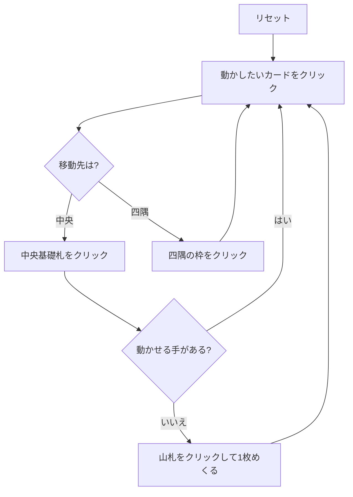

# ウィンドミル（Web版）遊び方

## ゲーム概要

52 枚 2 組（104 枚）で遊ぶソリティア。別名プロペラ (Propeller)。中央に A を 1 枚置き、その周囲に計 **8 枚**の「帆」を並べる。四隅の 4 枠は最初は空で、K が出てきたときにそこへ置く。

中央の基礎札は **A→K を 4 周して 52 枚**、四隅は **K→A で 13 枚ずつ**。52 + 13×4 = 104 枚をすべて積み切ればクリア。

## 起動方法

1. `go run ./cmd/trumpcards web` でサーバーを起動する
2. ブラウザで `http://localhost:8080` を開く
3. ゲーム一覧または左サイドバーから「ウィンドミル」を選ぶ

## ルール

- 52 枚 2 組（104 枚）。中央に A を 1 枚、帆に 8 枚、残り 95 枚が山札
- **中央基礎札**: スート無視の昇順。**K の次は A に戻る**。合計 52 枚で完成（画面に `n/52` と出る）
- **四隅の基礎札**: 最初は空で「K のみ」と表示される。K を置いたら降順で A まで 13 枚
- 使えるのは帆の 8 枚と捨て札の一番上
- 帆の札が動くと**即座に**捨て札（無ければ山札）から補充される
- 山札は 1 枚ずつ捨て札へ。**めくり直しは無い**
- **救済手は「四隅の一番上を中央へ引き戻す」1 つだけ。** 引き戻した直後は、次に中央へ置く札を帆か捨て札から取るまで再び使えない（画面にその旨が出る）

## ゲームの流れ

## 画面の操作方法

| 操作 | 説明 |
|------|------|
| 帆のカードをクリック | そのカードを移動元として選択する |
| 捨て札をクリック | 一番上の札を移動元として選択する |
| 四隅のカードをクリック（何も選択していないとき） | その札を移動元として選択する（＝引き戻しの準備） |
| 中央基礎札をクリック | 選択中のカードを中央に置く |
| 四隅の枠をクリック | 選択中のカードをその四隅に置く。空の枠は K のみ |
| 山札 / めくるボタン | 山札を 1 枚めくって捨て札へ送る |
| ドラッグ＆ドロップ | クリック 2 回と同じ移動をドラッグでも行える |
| ヒントボタン | 基礎札 → 引き戻し → めくる の順に手を 1 つ提示する |
| 自動完成ボタン | 帆と捨て札から基礎札へ送れる札がなくなるまで自動で送る（**四隅を崩す引き戻しは行わない**） |
| 元に戻す / 手詰まり脱出ボタン | 1 手戻す / 脱出に必要な手数だけまとめて戻す |
| ギブアップ / リセットボタン | 確認ダイアログのうえで投了 / やり直す |
| CLI トグル | 同じゲームをコマンド入力で操作するモードに切り替える |

キーボードショートカット: `d` めくる / `h` ヒント / `a` 自動完成 / `z` 元に戻す / `g` ギブアップ（確認あり）。

## 画面構成

- **上部**: フェーズ表示と手数
- **中央上段**: 中央基礎札（`n/52` の進捗つき）、四隅の 4 枠（`K0`〜`K3`、`n/13` の進捗つき）、山札と捨て札
- **引き戻し直後**: 「次に中央へ置く札は帆か捨て札から取ってください」という注意が出る
- **中央下段**: 帆 8 枚。`#0`〜`#7` はヒント表示の番号と一致する
- **下部**: ヒント表示、アクションログ、設定、キーボードショートカット一覧

## 遊び方のコツ

- **四隅は「置き場」であると同時に「貯金」でもある。** 中央で欲しくなりそうなランクを四隅の上に残しておくと、引き戻しで回収できる
- ただし**引き戻しは連続できない**。1 回使ったら、次の中央の 1 枚を帆か捨て札から用意できる形にしてから使う
- 帆は動かすたびに補充される。詰まりそうなときは帆を消化して盤面を回す
- 山札は 1 巡しか回らない。めくる前に置き場所を考える
- K を早く四隅に置くほど降順の受け皿が増える
- 詰まったら元に戻すで分岐をやり直す
