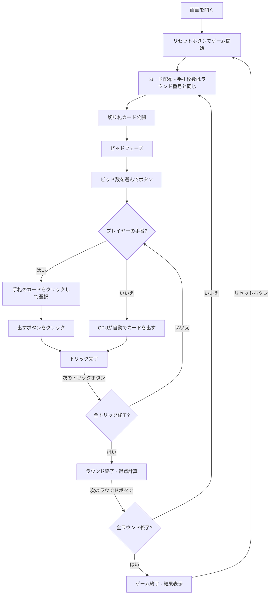

# ウィザード（Web版）遊び方

## ゲーム概要

4人（プレイヤー1人 + CPU 3人）で遊ぶ「ピタリ当て」型トリックテイキングです。通常の52枚に**ウィザード4枚**と**ジェスター4枚**を加えた60枚のデッキを使います。全15ラウンドを通して、獲得トリック数を正確に宣言（ビッド）することを目指します。全ラウンド終了後、累計得点が最も高いプレイヤーが勝者です。

> **原作クレジット**: 『Wizard（ウィザード）』は Ken Fisher 氏が1984年に考案し、U.S. Games Systems, Inc. が発行しているカードゲームです。本実装は非公式・非営利のファン実装であり、権利者とは関係がありません。ルールのみを独自に実装しており、原版のカードデザインやルールブック本文は使用していません。

## 起動方法

```sh
go run ./cmd/trumpcards web  # CLI経由でWebサーバーを起動
go run ./cmd/server          # 直接Webサーバーを起動
```

ブラウザで `http://localhost:8080` にアクセスし、ナビゲーションバーから「ウィザード」を選択します。
ナビバーのJA/ENボタンで日本語・英語を切り替えられます。

## ルール

### 基本ルール

- 60枚のデッキ（52枚 + ウィザード4枚 + ジェスター4枚）を4人に配布
- 手札枚数は**ラウンド番号と同じ**（ラウンド1=1枚 … ラウンド15=15枚）
- 配り終わった山札の一番上のカードが**切り札（トランプ）スート**を決定
  - めくったカードがウィザードならディーラーが切り札スートを選択
  - めくったカードがジェスターなら切り札なし
  - 手札を配りきって山札が残らない最終ラウンドは切り札なし
- 各ラウンド開始時にビッド（0〜手札枚数）を宣言（ディーラー制限は**なし**）
- **ウィザード**: いつでも出せて、そのトリックに**必ず勝つ**（先に出したウィザードが勝つ）
- **ジェスター**: いつでも出せて、そのトリックに**必ず負ける**
- それ以外はリードスートに従う（フォロースート）
- トリックの勝者: ウィザードがあれば最初のウィザード、なければ切り札の最高値、それもなければリードスートの最高値

### 得点

- **ビッド成功（正確に一致）**: 20 + 10 × ビッド数
- **ビッド失敗**: -10 × |獲得トリック数 - ビッド数|

### ゲーム終了

- 全15ラウンド終了後、累計得点が最も高いプレイヤーが勝利

### CPU難易度

- **Easy**: ランダムにビッド・カードを出す
- **Normal**: 基本的なトリック戦略（デフォルト）
- **Hard**: 戦略的なプレイ

## ゲームの流れ



## 画面の操作方法

### ビッドフェーズ

1. 0〜手札枚数のビッドボタンから宣言したい数を選びます
2. ウィザードは確実な取り札、ジェスターは確実な負け札として読みに含めます
3. ディーラーであってもビッド制限はありません

### カードのプレイ（プレイフェーズ）

1. 手札のカードをクリックして選択します
2. ウィザードとジェスターはいつでも出せます。それ以外はリードスートに従います
3. **「出す」** ボタンをクリックしてカードを場に出します

### ヒント

- ビッドフェーズまたはプレイフェーズで **「ヒント」** ボタンをクリックすると、推奨が表示されます
- ビッドフェーズでは推奨ビッド数、プレイフェーズでは推奨カードが黄色のメッセージで表示されます

### トリック・ラウンドの進行

1. トリックが完了すると結果が表示されます
2. **「次のトリック」** ボタンで次のトリックに進みます
3. ラウンドが完了すると得点が表示されます
4. **「次のラウンド」** ボタンで次のラウンドに進みます

### キーボードショートカット

| キー | アクション | 有効条件 |
|------|-----------|---------|
| `1`〜`9`, `0` | カード選択/解除（1=1枚目, ..., 9=9枚目, 0=10枚目） | プレイヤーの手番 |
| `Enter` | カードを出す / ビッド確定 | プレイヤーの手番 / ビッドフェーズ |
| `Escape` | 選択クリア | プレイヤーの手番 |

※ テキスト入力欄にフォーカスがある場合、ショートカットは無効になります。

## 画面構成

- **設定パネル（▶ 設定）**: 「CPU難易度」を Easy / Normal / Hard から選択。次のリセット時に適用されます
- **CPU プレイヤーエリア**: 各 CPU の累計得点、ビッド数、獲得トリック数を表示（手番の CPU は金色枠）
- **ゲーム情報**: 現在のラウンド/全15ラウンド、トリック番号、手札枚数、切り札スート、ディーラー
- **現在のトリック**: トリックに出されたカード（ウィザード・ジェスターは専用の絵札で描画）
- **フッター（あなたの手札）**: クリックで選択（緑枠 + 上に浮き上がる）
- **スコアテーブル**: 各プレイヤーのビッド、獲得トリック数、ラウンドスコア、累積スコア

## 遊び方のコツ

- ウィザードは必ずトリックを取れるので、確実な1点として数えましょう
- ジェスターは取りたくないトリックを安全に手放せます
- 切り札やウィザードの枚数を数えて、ビッドを慎重に宣言しましょう
- 正確なビッドが高得点の鍵です（多くても少なくても減点）
- 迷った時はヒントボタンで推奨を確認できます
