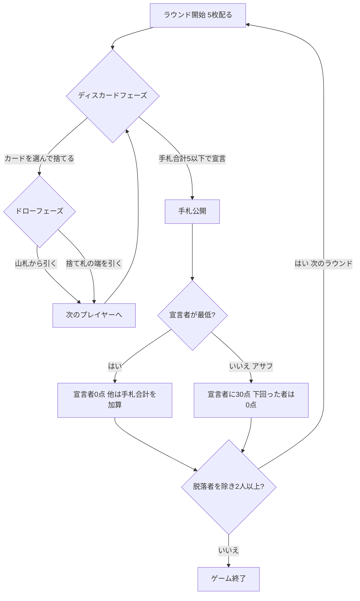

# ヤニブ（Web版）遊び方

## ゲーム概要

ヤニブ (Yaniv) は、イスラエル発祥のドロー＆ディスカードの手札計算ゲームです。手札を交換しながらカードの合計値を減らし、合計が5点以下になったら「ヤニブ！」と宣言してラウンドを終わらせます。宣言時に自分以下の相手がいると「アサフ」となり30点のペナルティを受けます。累計失点が脱落スコアを超えたプレイヤーから脱落し、最後まで生き残ったプレイヤーが勝者です。

- プレイ人数: 4人 (あなた + CPU 3人)
- 使用カード: 54枚 (ジョーカー2枚を含む。ジョーカー=0点、A=1点、J/Q/K=10点、その他は額面)
- 初期手札: 5枚
- 脱落スコア: 200 (設定で変更可能)

## 起動方法

```sh
go run ./cmd/trumpcards web         # CLI経由でWebサーバーを起動
go run ./cmd/trumpcards web --open  # サーバー起動 + ブラウザを開く
go run ./cmd/server                 # 直接Webサーバーを起動
```

ブラウザで `http://localhost:8080` にアクセスし、ナビゲーションバーから「ヤニブ」を選択します。
ナビバーのJA/ENボタンで日本語・英語を切り替えられます。

## ルール

1. 各プレイヤーに5枚配り、1枚を場の捨て札として表向きに置きます。
2. 自分の番ではまず手札を捨てます。捨てられるのは「単札1枚」「同じ数値の2枚以上の組」「同じスートの3枚以上の連番」のいずれかです。
3. 捨てた後、山札または直前のプレイヤーが捨てた束の端 (先頭か末尾) から1枚引きます。
4. 自分の番の開始時に手札の合計が5点以下なら、「ヤニブ！」を宣言してラウンドを終了できます。
5. 宣言者が最も低ければ宣言者は0点。他に宣言者以下 (同点含む) がいる場合は「アサフ」となり、宣言者に30点が加算されます。
6. 宣言者以外は手札合計が失点として加算されます (アサフ時、宣言者を下回ったプレイヤーは0点)。
7. 累計失点が脱落スコアを超えたプレイヤーは脱落します。最後の1人、またはあなたが脱落した時点でゲーム終了です。

## ゲームの流れ



## 画面の操作方法

- **カード選択**: ディスカードフェーズで手札のカードをクリックして選択します。複数選択して組や連番をまとめて捨てられます。
- **捨てる**: 「捨てる」ボタンで選択したカードを捨てます。
- **ヤニブ！**: 手札合計が5以下のとき「ヤニブ！」ボタンが有効になり、クリックでラウンドを終了します。
- **山札から引く**: ドローフェーズで「山札から引く」ボタンを押します。
- **捨て札の端から引く**: 場の捨て札の端 (左右) のカードをクリックして引きます。
- **次のラウンド**: ラウンド終了後に「次のラウンド」ボタンで次へ進みます。
- **設定**: CPU難易度と脱落スコアを設定パネルで変更できます。

## 画面構成

- **上部**: CPU プレイヤーの失点と裏向きの手札 (ラウンド終了時に公開)。
- **中央**: 山札の残り枚数と、引ける捨て札の束 (端のみ選択可能)。
- **下部**: あなたの手札・失点・手札合計。
- **フッター**: 「捨てる」「ヤニブ！」「山札から引く」「次のラウンド」「リセット」などの操作ボタン。

## 遊び方のコツ

- 絵札や高い数字のカードを早めに捨て、手札合計を下げましょう。
- 同じ数値の組や同じスートの連番をまとめて捨てると、一度に大きく合計を減らせます。
- 捨て札の端に低いカード (A やジョーカー) があれば積極的に拾いましょう。
- 手札合計が5以下になったら、相手に先を越される前にヤニブを宣言するのが基本です。ただしアサフ (30点) のリスクにも注意しましょう。
