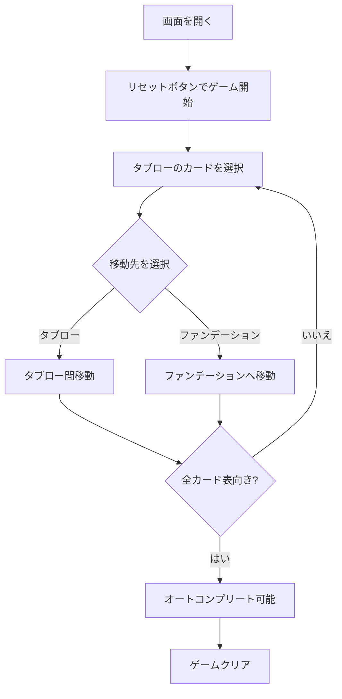

# ユーコン（Web版）遊び方

## ゲーム概要

ユーコンは1人用のソリティアカードゲームです。クロンダイクの派生で、山札（ストック）は存在せず、最初に52枚すべてのカードが7列のタブローに配られます。表向きのカードであれば並び順に関係なくまとめて移動できるのが最大の特徴です。4つの組札（ファンデーション）にスート別にA→Kの順に積み上げればクリアです。

## 起動方法

```sh
go run ./cmd/trumpcards web   # CLI経由でWebサーバーを起動
go run ./cmd/server           # 直接Webサーバーを起動
```

ブラウザで `http://localhost:8080` にアクセスし、ナビゲーションバーから「ユーコン」を選択します。
ナビバーのJA/ENボタンで日本語・英語を切り替えられます。

## ルール

### 配り方

- 7列のタブローにすべてのカード（52枚）を配ります
- 列0: 1枚（表向き）
- 列1〜6: 基本配り（列iにi+1枚、最上段のみ表向き）+ 追加4枚（表向き）

### 移動ルール

- **タブロー → タブロー**: 表向きのカードとその上に乗っているカード全てをまとめて移動できます。移動先の最上段カードと交互色・降順の関係が必要です。空の列にはKのみ置けます
- **タブロー → ファンデーション**: 列の最上段カードのみ移動可能。同じスートで昇順（A→K）

### ゲーム終了

- **クリア**: 4つのファンデーションすべてにA〜Kが揃うとクリア
- **ギブアップ**: いつでもギブアップ可能
- **手詰まり**: 有効な手がない場合、手詰まりと判定されます

## ゲームの流れ



## 画面の操作方法

### カードの移動

1. 移動したい表向きのカードをクリック（選択状態になる）
2. 移動先の列または組札をクリック
3. ドラッグ&ドロップでも移動可能

### キーボードショートカット

| キー | アクション | 有効条件 |
|------|-----------|---------|
| H | ヒント | プレイ中 |
| A | オートコンプリート | プレイ中 |
| G | ギブアップ | プレイ中 |
| Z | 元に戻す | アンドゥ可能時 |

## 画面構成

```
┌────────────────────────────────────────────┐
│  ♠ 組札  ♣ 組札  ♥ 組札  ♦ 組札          │
├────────────────────────────────────────────┤
│  列0  列1  列2  列3  列4  列5  列6        │
│  [K]  [??] [??] [??] [??] [??] [??]       │
│       [5]  [??] [??] [??] [??] [??]       │
│       [3]  [J]  [??] [??] [??] [??]       │
│       [8]  [7]  [Q]  [??] [??] [??]       │
│       [2]  [4]  [9]  [A]  [??] [??]       │
│            [6]  [3]  [10] [7]  [??]       │
│            [K]  [8]  [5]  [2]  [4]        │
│                       ...  ...  ...        │
├────────────────────────────────────────────┤
│  [リセット] [ヒント] [自動完成]            │
│  [元に戻す] [ギブアップ]                   │
└────────────────────────────────────────────┘
```

## 遊び方のコツ

- まず裏向きカードの列を解放することを優先しましょう
- Kを空いた列に移動して他のカードを整理できます
- ファンデーションに移動できるカードは早めに移動しましょう
- 手詰まりになったら「元に戻す」で戻ってやり直しましょう
