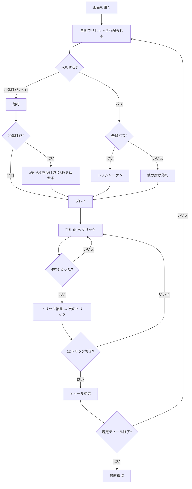

# ツヴァンツィガールーフェン（Web版）遊び方

## ゲーム概要

ツヴァンツィガールーフェン（Zwanzigerrufen）はオーストリアの「呼びタロック」系トリックテイキングです（4人：あなた + CPU3人）。タロック54枚を使い、落札者が**切り札の20番**を呼んでパートナーを決めますが、その札が場に出るまで誰が味方か分かりません。誰も落札しなければ**トリシャーケン**になり、最も多く点を取った人が負けます。

## 起動方法

```sh
go run ./cmd/trumpcards web  # CLI経由でWebサーバーを起動
go run ./cmd/server          # 直接Webサーバーを起動
```

ブラウザで `http://localhost:8080` にアクセスし、ナビゲーションバーから「ツヴァンツィガールーフェン」を選択します。
ナビバーのJA/ENボタンで日本語・英語を切り替えられます。

## ルール

### デッキと配布

- **デッキ**: タロック54枚（スート札32枚 + 切り札21枚 + スキュース1枚）。
- **配布**: 各席に **12枚**、残り **6枚**が場札（タロン）。

### 入札

- 選べるのは **「20番呼び」** と **「ソロ」** と **「パス」** です。高い入札が優先します。
- 全員がパスすると**トリシャーケン**になります。ボタンとしては存在しません（結果としてのみ成立する契約だからです）。

### 呼び札

- デクレアラーは切り札の20番を呼び、それを持つ人が秘密のパートナーになります。
- **自分で持っていれば19番、18番へ下げます。** すべて自分の手にあるときは単独です。
- 画面には「呼び札: 切り札20番（持ち主は秘密）」と出て、**呼ばれた札が場に出た瞬間に**パートナーの席が明かされます。

### 場札交換

- 20番呼びのデクレアラーは場札6枚を受け取り、手札から6枚を選んで伏せます。
- **キングとトゥルルは伏せられません。**

### プレイと精算

- リードスートに従い、持っていなければ切り札を出します。スキュースが最強です。
- 20番呼び／ソロはデクレアラー側が総カードポイントの半分超で成功。トリシャーケンは最多得点者が -3、他が +1。
- 精算はゼロサムで、規定ディール（1〜12、既定4）後に通算最多の席が勝ちです。

## ゲームの流れ



## 画面の操作方法

### 入札フェーズ

1. 「20番呼び」「ソロ」「パス」から選びます。**現在の最高入札が上に出ます**。
2. **上回れない入札のボタンは押せません**（誰かがソロを宣言した後の「20番呼び」など）。押せるかどうかは規則が決めています。
3. CPU の入札は自動で進み、あなたの番で止まります。

### 場札交換フェーズ

1. 手札から6枚をクリックして選びます（選んだ札は浮き上がります）。
2. 「伏せる（6/6）」ボタンが押せるようになったらクリックします。キングとトゥルルを選ぶとサーバが拒否します。

### プレイフェーズ

1. 手札をクリックするとその場で出ます。出せない札は薄く表示され、押しても送られません。
2. 4枚そろうと勝者が表示されるので、「次のトリック」で進みます。

### 結果

- ディール終了で席ごとの増減が出ます。「次のディール」で続けます。
- 規定ディール後に最終得点が出ます。「新しいゲーム」で設定を反映して始め直します。

### 設定

| 設定 | 範囲 | 説明 |
|------|------|------|
| CPU難易度 | Easy / Normal / Hard | Easy はランダムに打ちます |
| ディール数 | 1〜12 | 何ディールで決着するか |

### キーボードショートカット

| キー | アクション | 有効条件 |
|------|-----------|---------|
| Tab | 次の札へフォーカス移動 | 常時 |
| Enter / Space | フォーカス中の札を出す／選ぶ | 自分の手番 |

## 画面構成

```
┌────────────────────────────────────────────┐
│ ツヴァンツィガールーフェン                 │
│ ディール 1/4  トリック 3  契約: 20番呼び   │
│ 呼び札: 切り札20番（持ち主は秘密）         │
├────────────────────────────────────────────┤
│ あなた（デクレアラー） CPU1  CPU2  CPU3    │
│ 手札10枚  今局12点     …     …     …       │
├────────────────────────────────────────────┤
│              現在のトリック                │
│         [札] [札] [札]                     │
├────────────────────────────────────────────┤
│            あなたの手札（10枚）            │
│  [札] [札] [札] [札] [札] [札] [札] ...    │
├────────────────────────────────────────────┤
│  [次のトリック]              [リセット]    │
└────────────────────────────────────────────┘
```

- 上段が席の一覧。**相手の手札は届きません**（枚数と取った点数だけ）。
- 中央が現在のトリック、その下があなたの手札です。

## 遊び方のコツ

- **20番呼びは切り札が5枚以上あってから。** 味方が誰か分からないまま12トリック戦うので、切り札が細いと支えきれません。
- **呼ばれた切り札は出す時機が全て。** 出した瞬間に味方だと分かるので、読ませたくない場面では抱えます。
- **トリシャーケンでは勝たない。** 取った点数が多い席が負けます。高い札は早めに手放しましょう。
