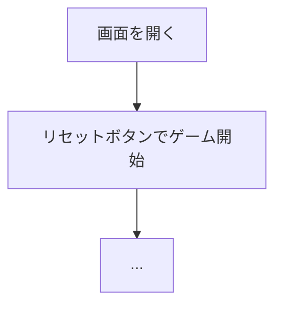

# ＜ゲーム名＞（Web版）遊び方

<!-- テンプレート: 新規Webマニュアル作成時にコピーして使用してください -->
<!-- ＜ゲーム名＞を実際のゲーム名に置き換えてください -->
<!-- 各セクションのガイドラインに従い、ゲーム固有の内容を記載してください -->
<!-- ゲーム固有のセクション（例: 特殊ルール）を追加しても構いません -->
<!-- この構成は internal/infrastructure/games/manual_template_test.go の -->
<!-- TestPerGameManualsFollowTemplate が検査します。見出し名・順序・Mermaid flowchart・ -->
<!-- 起動コマンドが合わないと CI が落ちます。worklist は bun scripts/audit-manual-template.mjs -->
<!-- API仕様は api/openapi.yaml に記載するため、このファイルには含めないこと -->

## ゲーム概要

<!-- ゲームの簡潔な説明（1〜2文）。プレイヤー数、ゲームタイプ、勝利条件を含める -->

## 起動方法

```sh
go run ./cmd/trumpcards web  # CLI経由でWebサーバーを起動
go run ./cmd/server          # 直接Webサーバーを起動
```

ブラウザで `http://localhost:8080` にアクセスし、ナビゲーションバーから「＜ゲーム名＞」を選択します。
ナビバーのJA/ENボタンで日本語・英語を切り替えられます。

## ルール

<!-- ゲームのルールを記載。必要に応じてサブセクションに分ける -->
<!-- 例: ### 基本ルール / ### 得点 / ### ゲーム終了 / ### CPU難易度 -->

## ゲームの流れ

<!-- Mermaid flowchartでゲームの進行を図示する（必須） -->
<!-- Web版ではボタン操作に基づいたフローにする -->



## 画面の操作方法

<!-- ゲームの各フェーズでの操作手順を記載 -->
<!-- 例: ### ベットフェーズ / ### プレイフェーズ / ### 結果フェーズ -->

### キーボードショートカット

<!-- 該当する場合に記載。テーブル形式でキー・アクション・有効条件を列挙 -->

| キー | アクション | 有効条件 |
|------|-----------|---------|

## 画面構成

<!-- ASCIIアートで画面レイアウトを示し、各エリアの説明を記載 -->

```
┌────────────────────────────────────────────┐
│  ...                                       │
└────────────────────────────────────────────┘
```

## 遊び方のコツ

<!-- 任意セクション（ガードは必須にしていません）。戦略やヒントを箇条書きで記載 -->
